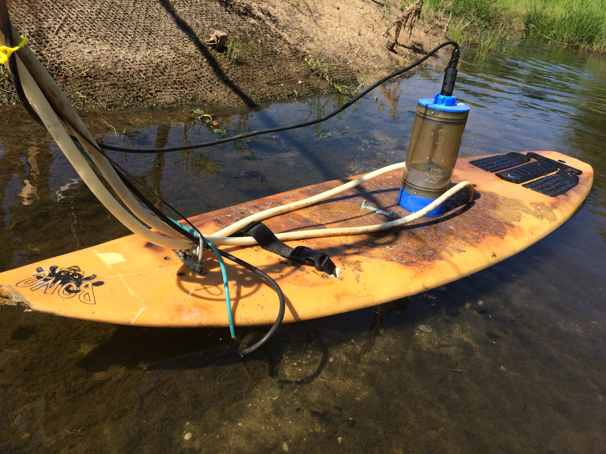

<script type="text/javascript"><!--
var imlocation = "images/";
 function ImageArray (n) {
   this.length = n;
   for (var i =1; i <= n; i++) {
     this[i] = ' '
   }
 }
image = new ImageArray(7);
image[0] = 'plymouthbioreactor.png';
image[1] = 'CLUP.png';
image[2] = 'iowabioreactor.png';
image[3] = 'daniatCLMD.png';
image[4] = 'lonniepoolwetland.png';
image[5] = 'CLUP.png';
image[6] = 'iowabioreactor.png';
var currentdate = new Date();
var imagenumber = currentdate.getDay();
document.write('');
//--></script>

<div class = "row">
<div class = "col-md-9"></div><div class = "col-md-3" align="right">*updated `r paste0(format(Sys.Date(), '%Y-%m-%d'),"*")`</div></div>
<br/><br/><br/>

# Overview
<br/>

Much of hydrology and water quality of natural stream and rivers is like an action movie: it is unpredictable and if we miss part of the movie, we run the risk of misunderstanding the whole story. 

Until very recently, to understand the "hydrological action movie" we had around 20-30 still images, i.e., concentration data points, per year...  An entire world is opening before our eyes thanks to new water quality sensors, which for the first time in history, give access to the full water quality story happening in streams, lakes and wetlands, in time and in space.  This is the **_new hydrological revolution_** at play right now!

<br/>

We are proponents of this technical revolution and we aim to address :

* Uncertainties on nutrient concentrations and loads from the treatment system to the catchment scale
* Biogeochemical processes in soil, treatment systems, and at the catchment scale
* How to improve pollutant removal efficacies in treatment systems
<br/><br/><br/><br/>

***
<br/><br/><br/><br/>

<div class = "row">
<div class = "col-md-4">
<center>

<br/><br/>
<a href='mailto:birgand@ncsu.edu'><i class="fa fa-envelope-o fa-2x" aria-hidden="true"></i></a>&nbsp;&nbsp;
<a href='https://github.com/francoisbirgand'><i class="fa fa-github fa-2x"></i></a>&nbsp;&nbsp;
<a href='https://www.youtube.com/channel/UC1_TZx_oSjdEB33OTuVAjUQ/videos'><i class="fa fa-youtube fa-2x"></i></a>&nbsp;&nbsp;
<a href='https://twitter.com/birgandwaterlab'><i class="fa fa-twitter fa-2x"></i></a>&nbsp;&nbsp;
<a href='https://scholar.google.co.uk/citations?user=uZDOygMAAAAJ&hl=en'><i class="fa fa-google fa-2x"></i></a>&nbsp;&nbsp;
<a href='https://www.linkedin.com/in/françois-birgand-72836a63/'><i class="fa fa-linkedin fa-2x"></i></a>&nbsp;&nbsp;
<a href='https://maps.ncsu.edu/#/buildings/dsw'><i class="fa fa-map-marker fa-2x"></i></a>
</center>
</div>

<div class = "col-md-8">
# Biography

I am an Associate Professor of Hydrology and Ecological Engineering in the Department of Biological and Agricultural Engineering at North Carolina State University in Raleigh, NC, USA. I direct the Biogeochemistry and Ecological Engineering Water lab where we try to improve the treatment efficiencies of streams, wetlands, soils or woodchip bioreactors.  
<br/>
Prior to my tenure at NC State, I worked as an engineering researcher at Cemagref in France (now Irstea) where I played an active role in maintaining longterm environmental observatories. Much of our current research methods are rooted in the metrology of flow and water quality in small catchments (< ~200 km²).
  
</div>
</div>

<br/><br/>

***
<br/><br/>

<div class = "row">
<div class = "col-md-8">

# Research
<br/>
We are poised to make an impact to improve our understanding of biogeochemical processes in systems such as streams, wetlands, soils or denitrification beds, collectively refered to as "treatment systems", so as to enhance their ability improve water quality.  

Our core method is the deployment of 'continuous' water quality sensors to obtain concentration data at a high resolution in space *and* in time. For this we have shown that we could use *in situ* spectrophotometers and measured absorbance as *index data* to develop what we refer to as *water quality rating curves*. Additionally, we have designed and built sequential autosamplers that add spatial resolution to the high resolution in time brought by the water quality sensors.  These systems offer a true revolution in the way we understand and design treatment systems. 

***[More...](research.html)***
</div>

<div class = "col-md-4">
<br/><br/><br/><br/>

</div>
</div>


<br/><br/>

***
<br/><br/>

# Selected publications
<br/>

```{r echo=FALSE,warning=FALSE,results="asis",message=FALSE}
library(RefManageR)

file_journals_EN <- ReadBib("selected_articles_EN.bibtex")

art_nb_EN <- length(file_journals_EN)


file_journals <- file_journals_EN
dates <- unlist(unique(file_journals$year))[order(unlist(unique(file_journals$year)),decreasing = TRUE)]

# make a list for numbering, but inactive as of October 2017
inc_nb<-art_nb_EN

#Prints references
for (date in dates) {
  cat(paste0("* "),"\t")
  print(file_journals[list(year=date)],.opts = list(style="markdown",bib.style ="authoryear" ,max.names =20,dashed=FALSE,no.print.fields = c("issn","eprint")))
  cat("\n")
}

```
<br/>

***[All publications...](publications.html)***


<br/><br/>

***
<br/><br/>

# Teaching
<br/><br/>

### Undergraduate level

* **[BAE 204](http://catalog.ncsu.edu/search/?P=bae+204&sa=Search)** – Introduction to Ecological Engineering (2 hrs. Spring -- instructor)
* **[BAE 474](http://catalog.ncsu.edu/search/?P=bae+474&sa=Search)** – Principles and Applications of Ecological Engineering (3 hrs. Spring -- co-instructor)  

<br/>

### Graduate level

* **BAE 590-607** – Biogeochemical  Processes for Ecological Engineering (3 hrs. Fall even years, Face to face + Distance Ed. -- instructor)

<br/>


```{r echo=FALSE, results="asis",comment=FALSE}
tutblog <- read.csv("birgand_tutblogs.csv", encoding = "UTF-8")
tutblog$date <- as.POSIXlt(as.Date(tutblog$date))
year<-(tutblog$date)$year + 1900
tutblog <- cbind(tutblog,year)
types <- unlist(unique(tutblog$type))[order(unique(tutblog$type),decreasing = TRUE)]

for (type in types){
  tutblog_type <- tutblog[tutblog$type == type,]
  years <- unlist(unique(tutblog_type$year))[order(unlist(unique(tutblog_type$year)),decreasing = TRUE)]
  cat("\n") 
  cat("###",type,"\n")
  for (year in years){
    tmp_tutblog <- tutblog_type[tutblog_type$year==year,]
    tmp_tutblog <- tmp_tutblog[order(tmp_tutblog$date, decreasing = TRUE),]
    cat("*",year,"\n")
    for (i in 1:nrow(tmp_tutblog)){
      cat("    + ",paste0("[",tmp_tutblog[i,]$name,"](",tmp_tutblog[i,]$reference,")"),paste0(" -- *started ",tmp_tutblog[i,]$date,"*"), sep = "")
      cat("\n")
    } # end nb of item per year
    
  } # end years loop

} # end type loop

```

<br/><br/><br/>