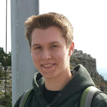

---
output:
  html_document:
    fig_width: 1
---

# Current personnel

***

## Staff

 

  
<a href='mailto:birgand@ncsu.edu'><i class="fa fa-envelope-o fa-2x" aria-hidden="true"></i></a>&nbsp;&nbsp;
<a href='https://github.com/francoisbirgand'><i class="fa fa-github fa-2x"></i></a>&nbsp;&nbsp;
<a href='https://www.youtube.com/channel/UC1_TZx_oSjdEB33OTuVAjUQ/videos'><i class="fa fa-youtube fa-2x"></i></a>&nbsp;&nbsp;
<a href='https://twitter.com/birgandwaterlab'><i class="fa fa-twitter fa-2x"></i></a>&nbsp;&nbsp;
<a href='https://scholar.google.co.uk/citations?user=uZDOygMAAAAJ&hl=en'><i class="fa fa-google fa-2x"></i></a>&nbsp;&nbsp;
<a href='https://www.linkedin.com/in/françois-birgand-72836a63/'><i class="fa fa-linkedin fa-2x"></i></a>&nbsp;&nbsp;
<a href='https://maps.ncsu.edu/#/buildings/dsw'><i class="fa fa-map-marker fa-2x"></i></a>

### François Birgand

I am an Associate Professor of Hydrology and Ecological Engineering and I direct the Biogeochemistry and Ecological Engineering Water lab since 2008 where we try to improve the treatment efficiencies of streams, wetlands, soils or woodchip bioreactors. There are three main reasons why I am in academia: I have an insatiable need to know more (the scientist in me), I want to provide smart solutions (the *ingénieur* in me), and I love to teach what I have understood (teacher in me).
 
On [Howard Garner's theory of multiple intelligences](https://en.wikipedia.org/wiki/Theory_of_multiple_intelligences), I score the highest on the *naturalistic* one. Much of my research approaches are rooted in the unquenchable need to observe and quest to better understand nature. I am not particularly good at conceptualizing, and I tend to believe things for which there is or I can find/provide very strong evidence. Naturally (!), I like birds, botany, classical music, singing, spirituality, and R! 
  

 

***

 

### Samuel Garvey

I direct the instrumentation, installation and field maintenance of our equipment in the field. etc.

  
<a href='mailto:sjgarvey@ncsu.edu'><i class="fa fa-envelope-o fa-2x" aria-hidden="true"></i></a>

 

***

 

## Graduate Students

 

  
<a href='mailto:birgand@ncsu.edu'><i class="fa fa-envelope-o fa-2x" aria-hidden="true"></i></a>

### Beth Allen

Ph.D. candidate, I am the main developer of the *Water Quality Rating Curve* package to predict concentrations from absorbance data.

 

***
 

### Bryan Maxwell

Ph.D. student, I currently work on 'looking inside the blackbox' of woodchip bioreactors. 

  
<a href='mailto:bmmaxwel@ncsu.edu'><i class="fa fa-envelope-o fa-2x" aria-hidden="true"></i></a>

 

***

 

  
<a href='mailto:smoin@ncsu.edu'><i class="fa fa-envelope-o fa-2x" aria-hidden="true"></i></a>

### Sheida Moin

Ph.D. student, I work on characterizing the internal functioning of urban wetlands and on using smart technology to improve their treatment efficiency. More short biography here.

 

***
 

### Cyrus Belenky

M.S. student, I work on quantifying the water quality benefits of a stream restoration in the coastal plain of NC. More short biography here. 

  
<a href='mailto:cnbelenk@ncsu.edu'><i class="fa fa-envelope-o fa-2x" aria-hidden="true"></i></a>

 

***

 

  
<a href='mailto:qhang@ncsu.edu'><i class="fa fa-envelope-o fa-2x" aria-hidden="true"></i></a>&nbsp;&nbsp;
<a href='https://scholar.google.co.uk/citations?user=uZDOygMAAAAJ&hl=en'><i class="fa fa-google fa-2x"></i></a>&nbsp;&nbsp;
<a href='https://www.researchgate.net/profile/Qianyu_Hang2'>RG</a>&nbsp;&nbsp;

### Qianyu (Joey) Hang

Ph.D. student. I came to NC State after completing my Master's degree in environmental engineering at Chinese Research Academy of Environmental Sciences in China. During my master’s study, I focused on the application of plant carbon source in improving nitrate removal efficiency for treatment of nitrate-rich agricultural runoff by constructed wetlands and bioreactors.  
At NC State, I work on quantifying the water quality benefits of a stream restoration in the coastal plain of NC. The overarching questions that motivate my research are 1) whether stream restoration does improve water quality? 2) how do we precisely quantify and interpret the real impacts of stream restoration on water quality? 

 

***
 

## Undergraduate Students

 

### Dani Winter

Undergraduate senior, I work on quantifying the water quality benefits of a stream restoration in the coastal plain of NC. More short biography here.

  
<a href='mailto:dewinter@ncsu.edu'><i class="fa fa-envelope-o fa-2x" aria-hidden="true"></i></a>

 

***

 

  
<a href='mailto:jayount2@ncsu.edu'><i class="fa fa-envelope-o fa-2x" aria-hidden="true"></i></a>

### Andrew Yount

Undergraduate junior, I work on quantifying the water quality benefits of floating wetland islands. More short biography here.

 

***

 

### Maya Hoon

Undergraduate senior, I work on quantifying the water quality benefits of floating wetland islands. More short biography here.

  
<a href='mailto:mhoon@ncsu.edu'><i class="fa fa-envelope-o fa-2x" aria-hidden="true"></i></a>

 

***

# Previous personnel

* Dr [Chiao-Wen Lin](https://www.linkedin.com/in/chiao-wen-lin-a21008147/) -- Ph.D. 2017
* Dr Nicole Dobbs -- Ph.D. 2016
* Mrs Taylor Carter -- M.S. 2016
* [Dr Troy Gilmore](https://engineering.unl.edu/bse/faculty/troy-gilmore/) -- Ph.D. 2015
* [Dr Randall Etheridge](http://www.ecu.edu/cs-cet/engineering/James-Etheridge.cfm) -- Ph.D. 2013
* Ms Erin Bennett -- M.S. 2013
* Mr Marc Horstman -- M.S. 2011
* Mr James Crouse -- M.S. 2011
