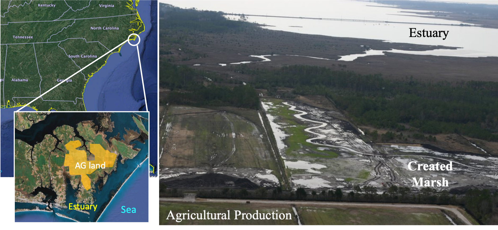
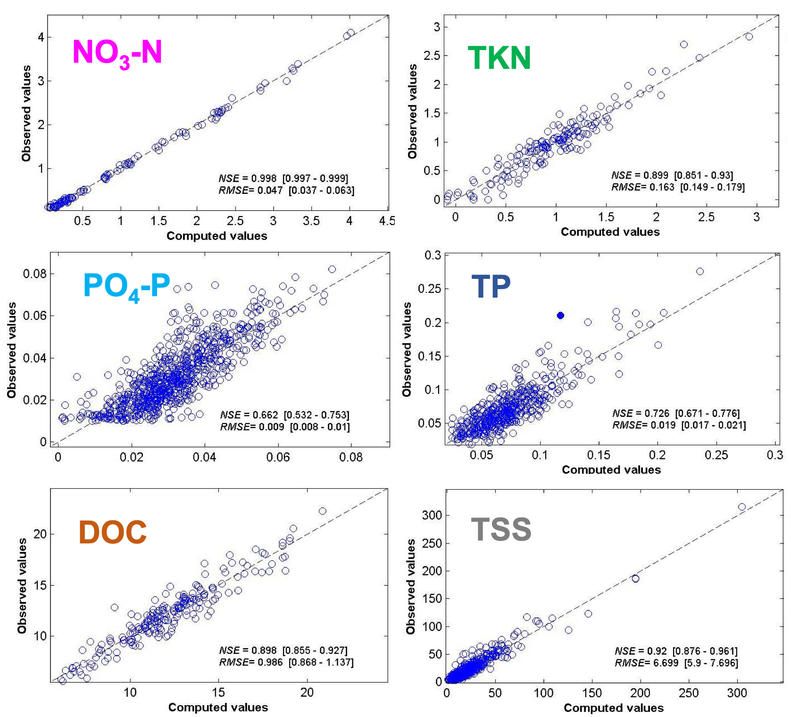
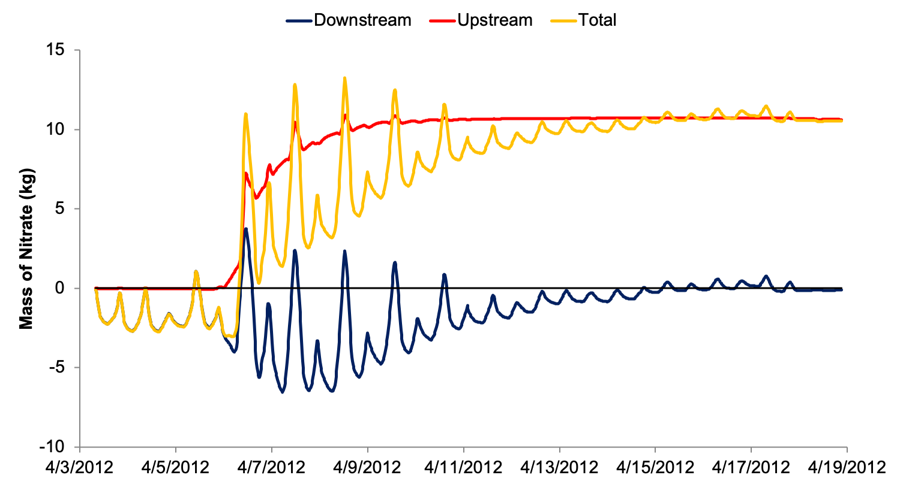
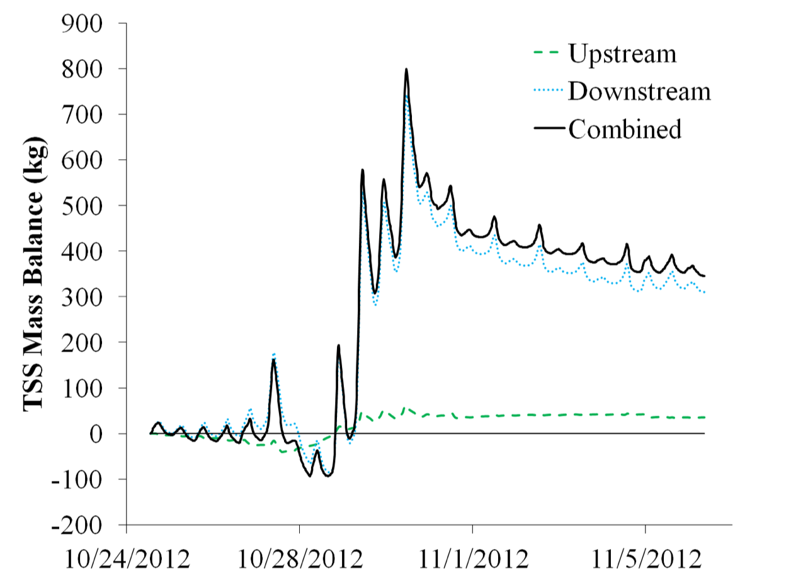
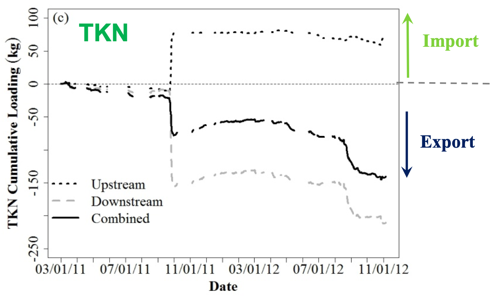

<br/><br/>

- Participants: 
    - [Randall Etheridge](https://cet.ecu.edu/engineering/faculty-and-staff/randall-etheridge/) (PhD Student then)
    - Molly Mikan (MS Student then)
    - [Yo-Jin Shiau](https://sites.google.com/view/yojinshiau/english?authuser=0) (PhD Student then)
    - [François Birgand](index.html) (NCSU)
    - [Michael Burchell](https://www.bae.ncsu.edu/people/mrburche/) (NCSU)
    - [Ken Krauss](https://www.usgs.gov/staff-profiles/ken-krauss?qt-staff_profile_science_products=0#qt-staff_profile_science_products) (USGS)
    - [Chris Osburn](https://meas.sciences.ncsu.edu/people/closburn/) (NCSU)

- Timeline: 
    - April 2010 - December 2014

- Funding Agencies: 
    - the Environmental Protection Agency under Grant Nr EPA 2871 through NC Dept. of Environment and Natural Resources
    - National Science Foundation under Grant Nr DGE-0750733 
    - NC Sea Grant under grant 2011-R/MG-1108;

<br/><br/>

## Project Overview

<br/>

Because of their potential to remove nutrients from drainage, salt marsh restorations have been ongoing in North Carolina and other coastal states. How much these restorations improve water quality is still unknown. Assessing the water quality benefits is difficult in salt marshes due to the complicated patterns of flow and incoming nutrient concentrations. Ebb and flow induce wide concentration and flow variations, and it is usually very difficult to close a water balance.

<br/>

<center>

<br/>
Aerial view of the constructed marsh at the interface between Agricultural land and the North River estuary, NC, USA
</center>

<br/>

A salt marsh restoration was strategically implemented between drained row-crop agriculture and a nearby estuary near Beaufort in Eastern North Carolina. Construction of this salt marsh was overseen by members of the [Bio&Ag Department](https://www.bae.ncsu.edu/) and was completed in 2007. This project provided a great opportunity to provide answers to the question of by how much do salt marsh restorations improve water quality.

<br/><br/>

#### Project goals

- Demonstrate non-traditional design techniques for restoring wetlands to an agricultural landscape
- Create a stable tidal creek and marsh ecosystem that integrated into surrounding marsh
- Reduce exports of agricultural pollutants to the North River estuary
- Evaluate ecosystem services provided by the constructed marsh, **specifically quantify NO3-N retention in the marsh**

<br/>

#### Objectives and deliverables

- Assessment of the performance of the field Spectrophotometer instruments to measure local concentrations *in situ*
- Assess whether fluorescence data from the CDOM sensor can be used to predict DON concentrations
- Description of the tidal and seasonal dynamics of nutrients and OM in a restored tidal marsh
- Quantification of the fate and sources of OM in a tidal marsh over long periods of time
- Quantification of the ability of a restored tidal marsh to retain excess runoff nitrogen and phosphorus
- Provide design guidance for future coastal marsh restoration projects

<br/><br/>

## Mass balance and high-frequency sensors

<br/>

Tidal marshes are by definition almost always open systems where flow and ebb might not use the same entrance and exit. This renders closing a mass balance an almost impossible task. The marsh was constructed slightly inland where an active area, inlet, and outlet could be defined, opening the possibility of closing a water and nutrient balance.

- In- and outlet flow:
   - Doppler velocity meters were installed in the tidal creek within trapezoidal flumes
   - **Accurate bi-directional velocity** and water level measurements


<br/><br/>

<center>

<br/><br/>
Map of the monitoring layout with inlet (top) and outlet (bottom) flumes
</center>


<br/><br/>

- High frequency Water quality: 
    - *in situ* UV-visual spectrophotometers ([Spectro::lyser](https://www.s-can.at/products/spectrometer-probes) from S::CAN); Had to solve fouling issues by pumping water to sensor
    - Multiparameter probes to measure Chromophoric Dissolved Organic Matter(CDOM), Dissolved Oxygen (DO), pH, conductivity and temperature
    - We hypothesized that we could correlate absorbance to our parameters of interest using PLSR (Partial Least Square Regression)

 
<br/><br/>

<center>

<br/><br/>
Equipment setup at the outlet station with Spectro::lyser installed above water
</center>

<br/><br/>

## Results highlights in pictures

### Flow patterns in the marsh

<br/>

The monitoring system was able to capture the very complex flow patterns at the inlet and outlets as illustrated in the video below.

<br/><br/><br/>

<center>
<iframe width="800" height="444" src="https://www.youtube.com/embed/sZEoah_aG6Q" frameborder="0" allow="accelerometer; autoplay; clipboard-write; encrypted-media; gyroscope; picture-in-picture" allowfullscreen></iframe>
<br/><br/>
Bidirectional flow patterns in April 2011.  Inlet (top arrow and hydrograph) and outlet (bottom arrow and hydrograph)
</center>

<br/><br/><br/>

Another fascinating way to represent flow in tidal marshes is the 'tidal harmonics' as illustrated in the video below.

<br/><br/><br/>

<center>
<iframe width="800" height="334" src="https://www.youtube.com/embed/s-SDJFAk4RA" frameborder="0" allow="accelerometer; autoplay; clipboard-write; encrypted-media; gyroscope; picture-in-picture" allowfullscreen></iframe>
<br/><br/>
Bidirectional flow at the inlet stage as a function of rising and falling tides illustrating tidal harmonics
</center>

<br/><br/><br/><br/>

### Water Quality highlights

- We used **PLSR** (Partial Least Square Regression) chemometrics to establish local calibrations between absorbance + fluorescence and concentrations
- We were the first ones to report **Water Quality Rating Curves** (WQRC) between absorbance and nitrate, total Kjeldahl nitrogen, DOC, phosphate, total phosphorus, total suspended solids, particulate organic matter and salinity, in **a tidal marsh setting**.


<br/><br/><br/>

<center>

<br/><br/>
Calibration obtained using PLSR to correlate absorbance + fluorescence to concentrations (in mg/L). Plots obtained using Fiteval[^1]
</center>

<br/><br/><br/><br/>

Using the WQRC, we were able to obtain 15 min concentration chemographs over a period of about 13 months (with some holes) at both stations, along with 15 min bidirectional flow. Below are some examples of the reactivity of flow and concentrations for nitrate and for TSS during hurricane Sandy.

<br/><br/><br/>

<center>
<iframe width="800" height="444" src="https://www.youtube.com/embed/_MLtx8XJnwU" frameborder="0" allow="accelerometer; autoplay; clipboard-write; encrypted-media; gyroscope; picture-in-picture" allowfullscreen></iframe>
<br/><br/>
Flow and nitrate dynamics at the outlet station in April 2012
</center>

<br/><br/><br/><br/>

<center>
<iframe width="800" height="444" src="https://www.youtube.com/embed/lsWHdz6mF3A" frameborder="0" allow="accelerometer; autoplay; clipboard-write; encrypted-media; gyroscope; picture-in-picture" allowfullscreen></iframe>
<br/><br/>
Flow and TSS dynamics at the outlet station before and during **hurricane Sandy (28-29 October 2012)**
</center>

<br/><br/><br/><br/>

### Mass balance highlights

<br/><br/>

From the high frequency flow and concentration data, we were able to calculate nutrient and material fluxes at both stations and compute a mass balance over time

<br/><br/>

<center>

<br/><br/>
Example of the computed mass balance for nitrate in April 2012 for the constructed marsh showing nitrate from the Agricultural land was retained within the marsh. **Positive values** correspond to **nitrate mass entering** the marsh; **negative values** correspond to **nitrate mass leaving** the marsh
</center>

<br/><br/><br/><br/>

<center>

<br/><br/>
Example of the computed mass balance for TSS in October 2012 for the constructed marsh **before, during, after hurricane Sandy**. The balance shows a positive retentin of TSS, most of which coming from the estuary into the marsh. **Positive values** correspond to **TSS mass entering** the marsh; **negative values** correspond to **TSS mass leaving** the marsh
</center>

<br/><br/><br/><br/>

### Water balance intrigue

<br/>

One of the most puzzling results has been the water balance. We expected that because of the balance between rainfall and precipitation, during winter, the excess rainfall would lead to a net apparent "export" of water from the marsh out, and reversely, during summer, the excess evapotranspiration would lead to a net replenishment of water into the marsh from tidal waters (red curve in figure below). 

We observed almost the opposite or a mirror image (blue curve in figure below)... In other words during excess rainfall, the marsh acted as a sink for water, and during summer, the marsh was a source of water...?! To this day, we do not have any obvious explanation. We have obviously verified all the sources of error but we were not able to find significant ones that could explain the observed phenomenon of a ***two-way water pump***.

<br/><br/>

<center>

<br/><br/>
The very intriguing water balance in the marsh that acted as a ***two-way water pump*** over the 20-month monitoring period.  **Positive values** correspond to **water volume entering** the marsh; **negative values** correspond to **water volume leaving** the marsh
</center>

<br/><br/><br/><br/>


### Nitrate retention in the marsh

The skewed water balance did not have significant effects on the computed nitrate balance as nitrate fluxes occurred as short-lived pulsed from the upstream agricultural land. Overall, the marsh **retained about 10% of the nitrate fluxes** that entered it over the 20-month period. However, there were holes in the water quality data, as we solved fouling problems and were still learning how to use these sensors, limiting the robustness of the final value of the balance.

<br/><br/>

<center>

<br/><br/>
Overall nitrate mass balance showing a **net retention of nitrate** over the 20-month monitoring period, although holes in the concentration data lowers the certainty on the overall retention. **Positive values** correspond to **nitrate mass entering** the marsh; **negative values** correspond to **nitrate mass leaving** the marsh
</center>

<br/><br/><br/><br/>

### The marsh behaved as an outwelling one-way nutrient pump

The water balance did have an impact on other nutrients such as dissolved organic carbon (DOC) and ammonium + organic nitrogen (TKN). The reversal of the water blance was not accompanied by a reversal of the direction of the fluxes. Rather, there was an apparent net export of DOC and TKN from the marsh out to the estuary, illustrating the fact that the constructed marsh acted as an outwelling one-way nutrient pump, despite the two-way water pump. These resuls are illustrated in the figures below.

<br/><br/>

<center>

<br/><br/>
Overall TKN mass balance showing a **net export of ammonium + organic nitrogen** over the 20-month monitoring period. **Positive values** correspond to **mass entering** the marsh; **negative values** correspond to **mass leaving** the marsh
</center>

<br/><br/><br/><br/>

<br/><br/>

<center>

<br/><br/>
Overall DOC mass balance showing a **net export of organic carbon** over the 20-month monitoring period. **Positive values** correspond to **mass entering** the marsh; **negative values** correspond to **mass leaving** the marsh
</center>

<br/><br/><br/><br/>

## Finding highlights

<br/>

- Found solutions to minimize fouling of the instruments
- PLSR to calibrate spectrophotometer to measure nitrate, total Kjeldahl nitrogen, DOC, phosphate, total phosphorus, total suspended solids, particulate organic matter and salinity
- Long-term 15-min data: essential to make meaningful conclusions
- Nitrate retention values mid-way between stream and non-tidal wetlands
- Marsh: 2-way water pump, 1-way nutrient pump
- Nutrient outwelling confirmed?

<br/><br/><br/><br/>

## Publications associated with this project

<br/>

```{r echo=FALSE, results="asis",comment=FALSE}

library(RefManageR)

file_journals_EN <- ReadBib("journal_articles_NR.bibtex")
art_nb_EN <- length(file_journals_EN)


file_journals <- file_journals_EN
dates <- unlist(unique(file_journals$year))[order(unlist(unique(file_journals$year)),decreasing = TRUE)]

# make a list for numbering, but inactive as of October 2017
inc_nb<-art_nb_EN
art_list<-list()
for (date in dates) {
  i=1
  yart_nb<-sum(sapply(file_journals_EN[list(year=date)],length))
  art_list[[date]] <- as.vector((inc_nb):(inc_nb - yart_nb + 1))
  art_list[[length(art_list) + i-1]] <-art_list[[date]]
  inc_nb = inc_nb - yart_nb
}

#Prints references
for (date in dates) {
#  cat(paste0("## ",date),"\n")
  print(file_journals[list(year=date)],.opts = list(style="markdown",bib.style ="authoryear" ,max.names =20,dashed=FALSE,no.print.fields = "issn"))
  cat("\n")
}

```

<br/><br/><br/><br/>


[^1]: Ritter, A., Muñoz-Carpena, R., 2013. Performance evaluation of hydrological models: Statistical significance for reducing subjectivity in goodness-of-fit assessments. J. Hydrol. 480, 33–45. https://doi.org/10.1016/j.jhydrol.2012.12.004