<br/><br/>

##### Participants and roles 

<div class = "row">
<div class = "col-md-6">
<center>**PIs**</center>
  - [François Birgand](index.html) (Lead-PI NCSU)
  - Chip Chescheir (co-PI NCSU, emeritus)
  - [Laura Christianson](https://cropsciences.illinois.edu/people/profile/lechris) (co-PI University of Illinois)
  - [Matt Helmers](https://www.abe.iastate.edu/matthew-helmers/) (co-PI Iowa State University)
  - [Louis Schipper](https://scholar.google.com/citations?user=DkXX6dMp1oEC&hl=en) (co-PI University of Waikato)
  - [David William](https://www.linkedin.com/in/david-williams-1aa4202b/) (co-PI US EPA)
  - [Mohamed Youssef](https://www.bae.ncsu.edu/people/mayousse/) (co-PI NCSU)
  - Sam Garvey (Research assistant)
    
</div>
<div class = "col-md-6">
<center>**Students and Postdocs**</center>
  - [Bryan Maxwell](https://www.researchgate.net/scientific-contributions/Bryan-Maxwell-2143225971) (BAE PhD Student)
  - [Wenlong Liu](https://scholar.google.com/citations?user=5_uL0OYAAAAJ&hl=en) (BAE PhD Student)
  - [Augustin Thomas](https://www.linkedin.com/in/augustin-thomas-60a631112/?originalSubdomain=fr) (École Polytechnique Student Intern)
  - [Sam Blackman](https://www.linkedin.com/in/samuel-blackman-87697a108/) (BAE undergraduate Student Intern)
  - [Mallory Alman](https://www.linkedin.com/in/mallory-alman/) (BAE undergraduate Student Intern)
  - Caleb Ray (Electrical Engineering undergraduate student)
  - [Lamyaa Negm](https://scholar.google.com/citations?user=4XvnXVUAAAAJ&hl=en) (BAE PostDoc)
  - [Shiying Tian](https://www.researchgate.net/profile/Shiying_Tian) (BAE PostDoc)
</div></div>

<center>

<br/>
</center>
<br/>

##### Timeline: 

  - April 2016 - December 2020

##### Funding Agencies: 

  - USDA-NIFA: Award 2016-67019-25279             
  - USDA Multistate S1063

<br/><br/>

## Project Overview

<br/>

Denitrifying bioreactors hold great promise as one of the tools to reduce nitrogen loadings to estuaries and coastal waters.  The idea is simple: create hot spots  of denitrification at the edge of field, and pipe nitrated waters into this hotspot. Practically, denitrifying bioreactors usually consist in large lined containers filled with a solid carbon substrate (often wood chips or other carbon source locally available and inexpensive), and through which water containing nitrate is passed. The carbon acts as electron donor to microbes for their respiratory needs. Nitrate becomes the first electron acceptor after oxygen has been depleted, and during denitrification, nitrogen leaves the aquatic system in gaseous forms as N~2~ and N~2~O.

<br/>

<center>

<br/>
Typical denitrifying bioreactor installed at the edge of field intercepting drainage water at the edge of field [@Christianson2011-bu]
</center>

<br/><br/>

These treatment systems are simple in many ways often involving minimal maintenance for 15-20 years. Typical “average” removals are estimated to be on the order of 25 to 50% of the annual nitrate mass loaded to them, although as low 11% and as high as 74% removals have been reported. 

This project arose from the conjunction of three observations:

1. bioreactors are generally viewed as ‘black boxes’, where their internal hydraulic and biochemical functioning remain unknown, leaving little opportunity to better quantify processes and their kinetics, therefore little opportunity to improve them
2. their efficiencies seem to drastically diminish after one to five years, calling to find ways to 'rejuvenate' them and/or maintain their nitrate removal activities
3. our [lab developped instrumentation](researchHRD.html) able to measure water quality at a high resolution in time and in space, which had the potential to address the first two points

<br/><br/>

## Hypotheses

<br/>

1.	We hypothesized that, using our instrumentation, one could measure and predict the movement of elementary volumes and the fate of nitrate and other nutrients they contain during flow inside bioreactors, for a variety of water management conditions  
2.	We hypothesized that to maintain denitrification potentials in bioreactors, one could find ways to ‘rejuvenate’ the substrate and that this could be modeled in biochemical modules 
3.	We hypothesized that bioreactors could be ‘rejuvenated’ at an acceptable increase of collateral emissions and an acceptable decrease of substrate lifetime
4.	We hypothesized that N~2~O isotopic ratios and information on the nature of the organic matter produced would help identify metabolic pathways and be instrumental in modeling 
5.	We hypothesized that hydrodynamics and biochemical functioning could be integrated into biogeochemical computer models to reconstruct apparent nitrate removal rates 
6.	We hypothesized that these models could be used to define optimized design and management guidelines, across a gradient of substrate, climate and hydrological functioning 

<br/><br/>

## Objectives

<br/>

1. Validate a micro-volume multiplexed sampler coupled to a spectrophotometer to obtain high frequency nitrate and Dissolved organic carbon (DOC) on a replicated manner and/or at a high spatial resolution
2. Quantify in the lab the impact of Drying-ReWetting (DRW) cycles on nitrate removal rates to assess whether it could be used as a rejuvenation method
3. Quantify in the lab the impact of Drying-ReWetting (DRW) cycles on N~2~O and CO~2~ gaseous emissions
6. Quantify the impact of water pore velocity inside bioreactors on the nitrate removal rates in the lab
4. Identify potential metabilic pathways associated with Drying-ReWetting (DRW) cycles 
5. Quantify the transport and fate of nitrate in three field woodchip bioreactors over several week periods in different climatic settings
7. Provide algorithms predicting nitrate removal in woodchip bioreactors

<br/><br/>


## Methods

<br/>

In this project, we ran lab and field experiments, and used the results to inform and steer the modeling effort. 

- In the lab, we ran a total of four column experiments. 
    - Most of the effort was concentrated on two long-term (287 and 105 days) testing and quantifying the ability of DRW cycles to increase nitrate removal in woodchip bioreactors. 
    - Two shorter term (11 weeks) experiments were conducted to quantify the impact of porewater velocity on nitrate removal rates, and we started an experiment on the ability of using electrical current to stimulate denitrification (aborted because of Covid-19) 
    
- In the field, 
    - we monitored water quality during 14 months at the inlet of the Plymouth bioreactor (North Carolina), and 
    - we conducted three short-term (2-5 weeks) experiments quantifying the fate and transport of nitrate inside the Nashua (Iowa) and the Tatanui (New Zealand) bioreactors 

<br/>

### Multiplexed high frequency gas and water quality sensors in lab and field experiments

<br/>

The common theme in the methodological approach in this project was high frequency sensors coupled with multiplexed sampling devices. The high frequency sensor for water quality was the [Spectro::lyser](https://www.s-can.at/products/spectrometer-probes)&reg; spectrophotometer from S::CAN&reg;. This instrument measures the absorbance of light in water, from which one can calculate nitrate and DOC concentrations, among others. The spectrophotometer was essentially used as a high-frequency portable lab. 

<br/><br/>

<center>

<br/><br/>
Spectro::lysers from S::can fitted with a flow-through cuvette in the lab (left, behind the black cuvette holder) and installed in the field at the Nashua (Iowa) bioreactor in June 2017 (right, flow-through cuvette held by Dr. Bryan Maxwell)
</center>

<br/><br/>

In the lab, the Spectro::lyser was fitted with a small volume multiplexer (&micro;MUX) [@Maxwell2018-tf], developed in Birgand's lab, able to sequentially sample water from each of the eight experimental columns to the Spectro::lyser probe for a final 2-hour resolution for each column. The sample volume was minimized to about 30 ml per sample thanks to a 0.9 mm tubing manifold,  to least disturb the column functioning. In the field, Spectro::lysers were fitted with the MUX&trade; developed in Birgand's lab [@Birgand2016-to] and now available via [MultiplexÔ, LLC](https://www.multiplexollc.com), a company started during the project. The MUX&trade; uses &#8539; inch diameter allowing to pump for longer distances, but for conditions in which a sample volume of 300-500 ml is thought not to perturb the system.

<br/><br/>

<center>
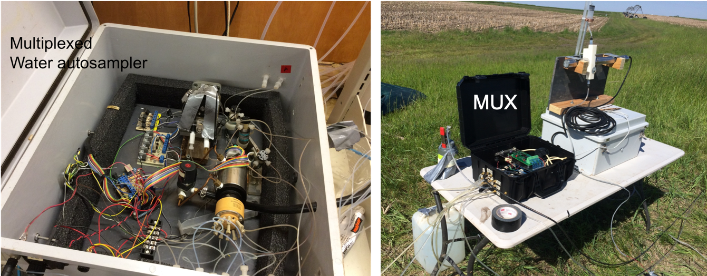
<br/><br/>
The small multiplexed water sampler used in the lab (left) and a large volume multiplexed sampler (MUX&trade;) used in the field (June 2017, Nashua bioreactor, Iowa)
</center>

<br/><br/>

Two high frequency gaseous sensors were used for experiments in the lab. A DYNOMITE dual quantum cascade laser (QCL) measurement system (DYnamic Nitrous Oxide Measurements in Terrestrial Ecosystems, Model CWQCL-200-D, Aerodyne Research Inc., Billerica, MA) was used to measure N~2~O gas and its isotopomers ^14^N^14^NO, ^15^N^14^NO, and ^14^N^15^NO. A LI-850 CO~2~/H~2~O (LI-COR&trade;, Lincoln, Nebraska, USA) gas analyzer was used to measure CO~2~. Both instruments were installed in series and coupled with a multiplexed pumping system.

<br/><br/>

<center>

<br/><br/>
Instruments for gas analysis, including a LI-COR 850 for CO~2~ measurements (top left), a DYNOMITE dual quantum cascade laser (QCL) for N~2~O measurement (top right), and the 16-way valve for multiplexed measurements
</center>


<br/><br/>

### Lab experiments setup

The lab experiments tested the ability of DRW cycles to stimulate denitrification in woodchip bioreactors. The literature has established that intermittent wetting of *normally unsaturated soils* tends to stimulate the mineralization of organic matter. We **hypothesized that DRW cycles would similarly stimulate mineralization of a *normally saturated* carbon substrate exposed to intermittent aerobic conditions**. We hypothesized that DRW cycles in woodchip bioreactors would generate more and possibly better labile carbon for denitrifiers. 


<br/><br/>

<center>
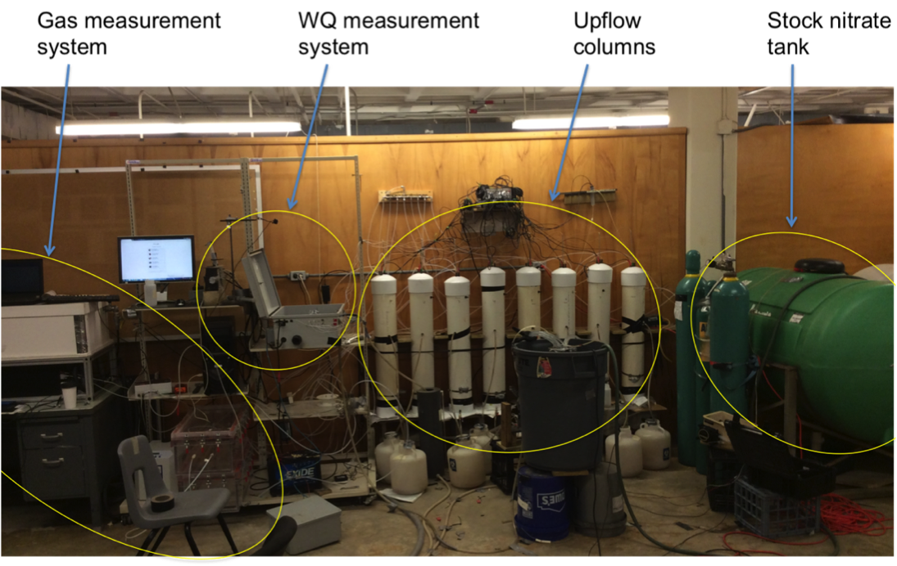
<br/><br/>
General setup for the lab experiment in 2017
</center>

<br/><br/>

For this, we ran a first 287-day experiment in 2017, which lead to the second 105-day in 2018. In the first experiment, we tested the effect on denitrification of weekly 8-hour exposure of woodships to aerobic conditions. In 2018, we tested the effect of the duration of the weekly aerobic conditions (2, 8, 24 hours). These experiments were lead by Bryan Maxwell. In 2019, we ran on the same columns a 7-wk experiment where we assessed the impact of the porewater velocity on the nitrate volumetric removal rates (experiment lead by Sam Blackman). In 2019-20, we started an experiment to quantify the impact of adding electrons from an electrical current to stimulate denitrification (experiment started by Mallory Alman but aborted because of Covid-19).

<br/><br/>

<center>
<iframe width="720" height="450" src="https://www.youtube.com/embed/vuD1cFtiSOI" frameborder="0" allow="accelerometer; autoplay; clipboard-write; encrypted-media; gyroscope; picture-in-picture" allowfullscreen></iframe>
<br/><br/>
Video illustrating the suite of equipment, pumping and sampling used during lab experiments
</center>

<br/><br/>

The experiments consisted in eight upflow experimental columns of  15.2-cm-diam.,  95-cm-tall  poly-vinylchloride filled with aged woodchips. Woodchips were collected  from  a 6-yr-old  field bioreactor  treating  drainage  from  a hog lagoon  sprayfield  in  Plymouth, NC. Each column had gravel at the bottom, overlaid by about 50 cm of woodchip, and 37 cm of headspace accounting for about 6.7 liters. Nitrated water prepared in stock tanks was pumped via an 8-channel peristaltic pump at the bottom of each column. 

<br/><br/>

<center>

<br/><br/>
Schematic of each column setup with sampling ports for water and gas measurements (top left), the 8-channel peristaltic pump (bottom left) and the composite bottles (bottom right) from which 8-hr average flow rates were calculated.
</center>

<br/><br/>

Nitrate and DOC concentrations were measured at the inlet and the outlet of each column sequentially using the &micro;MUX-Spectro::lyser system for a 2-hour resolution on each column. Water automatically sampled by the &micro;MUX was sampled manually during the purging phase and concentrations measured in the lab were correlated with the absorbance values for calibration [@Maxwell2019-ht; @Maxwell2019-ol]. Temperature and dissolved oxygen were measured using an Oxy-10 from PreSens&reg; at the inlet and the outlet of each column at 1-hr resolution. Flow rates were measured by measuring water accumulated over 5-8 hour periods in composite bottles. 

<br/><br/>

<center>
<iframe width="720" height="450" src="https://www.youtube.com/embed/J_1XrY7EAgs" frameborder="0" allow="accelerometer; autoplay; clipboard-write; encrypted-media; gyroscope; picture-in-picture" allowfullscreen></iframe>
<br/><br/>
Video of the high-frequency water sampling and analysis using the multiplexer-Spectro::lyser coupled system
</center>

<br/><br/>

For each column, headspace air was pumped over 5-min periods to the instruments which measured concentrations at 1 hz.  After 5-min, the multiplexer switched to the next column, to our reference 'zero air' and ambient air, such that the final resolution on gaseous concentrations would be calculated hourly. The sampled air was replenished with ambient air via a 10 cm open tubing at the top of each column. CO~2~ and N~2~O gases being heavier than air, it was expected that there would be minimum leakage of these gases out of the columns.

<br/><br/>

<center>
<iframe width="720" height="450"  src="https://www.youtube.com/embed/tOhs-3CloRo" frameborder="0" allow="accelerometer; autoplay; clipboard-write; encrypted-media; gyroscope; picture-in-picture" allowfullscreen></iframe>
<br/><br/>
Video of the headspace quality sampling with the sensors in place in 2017
</center>
<br/><br/>

<center>
<iframe width="720" height="450"  src="https://www.youtube.com/embed/-UJXoMwqPyA" frameborder="0" allow="accelerometer; autoplay; clipboard-write; encrypted-media; gyroscope; picture-in-picture" allowfullscreen></iframe>
<br/><br/>
Video of the CO~2~ concentrations headspace quality sampling with the sensors in place in 2017
</center>
<br/><br/>


### Field experiments setups
#### Setup at the Plymouth site, North Carolina
<br/>

The Plymouth bioreactor which was supposed to be the flagship of the field experiments because of its proximity to Raleigh (2.5 hour drive), was found to be essentially clogged... We then decided to apply our sampling methods to the monitoring of drainage water at the inlet of the bioreactor (which bypassed the bioreactor) and of the groundwater at several depths and distances from the drain line. This was a welcome addition to another research project lead by Dr. Youssef and Wenlong Liu's Ph.D. project [@Liu2020-ke; @Liu2020-jl]. The MUX&trade; capabilities were adapted to pump water from the bioreactor inlet, acid-rinse, and water-rinse the flow-through cuvette to keep iron fouling to a minimum. All information obtained would be used in the project as a databse for the modeling effort. This monitoring lasted a total of 14 months from January 2017 to March 2018.

<br/><br/>

<center>

<br/><br/>
Layout of high spatio-temporal resolution water quality monitoring at the Plymouth site (North Carolina). a) Nested wells at variable depths and distance from the drain to monitor shallow groundwater; (b) schematic of the groundwater sampling well; (c and d) pictures of the cups at the bottom of the wells intercepting water at an identified depth; (e) Bryan Maxwell (left) and Sam Garvey (right) near the sampling system at the bioreactor inlet; (f) picture of the the whole sampling system in the field [@Liu2020-ke; @Liu2020-jl]
</center>

<br/><br/>

#### Setup at the Nashua (Iowa) and Tatanui (New Zealand) bioreactors
<br/>

The experiments for the Nashua (IA) and Tatanui (NZ) bioreactors involved capturing the temporal and spatial dynamics of nitrate and DOC concentrations along the flow path within these field bioreactors. These experiments were temporary and short-term by nature. The monitoring involved sampling deep and shallow wells installed along the length of the bioreactors at a high temporal resolution (40 and 60 min for IA and NZ, respectively).


<br/><br/>

<center>

<br/><br/>
Layout of the wells used for high spatio-temporal resolution water quality inside the IA and NZ bioreactors
</center>

<br/><br/>

The woodchip bioreactor at Northeast Research Farm in Nashua, Iowa (42.9°N, 92.6° W) was monitored for 11 d from June 2–13 in 2017 and 13 d from April 1–14 in 2018. This field bioreactor (referred to as IA) receives tile drainage from a 14.2 ha corn-soybean rotation and was constructed in April 2009. The unlined bioreactor (128 m&sup3;) has a trapezoidal geometry (36.6 m L x 4.6 m top W x 2.4 m bottom W x 1.0 m D). The water table can fluctuate in this bioreactor leaving an always saturated volume and a volume that undergoes unsaturation. The six sets of existing shallow and deep wells were sequentially sampled by two MUX-spectro::lyser systems (one for the inlet and upper three sets, the other for the outlet and the lower three sets) for a resolution of 40 min for each well and in- or outlet. 

<br/><br/>

<center>

<br/><br/>
Pictures of the monitoring setup at the Nashua (IA, left; Bryan Maxwell and Caleb Ray from left to right) in June 2017, and at the Tatanui (NZ, right) in August 2018 to measure transport and fate of nitrate and DOC along bioreators over time
</center>

<br/><br/>

The second bioreactor located on a privately owned dairy farm close to Morrinsville, NZ (37.6°S, 175.6°E) was monitored for 30 d from August 8 – September 8 in 2018. This below-ground bioreactor (referred to as NZ) was constructed in 2016 with a rectangular pyramidal geometry (11.4 m top L x 9 m bottom L x 7.4 m top W x 5 m bottom W x 1.2 m D, 1:1 side slope, lined on the bottom and sides with an impermeable liner, a geotextile liner placed above the woodchips, and finally covered excavated soil. This bioreactor is permanently saturated below the water table with 0.94 m water depth during periods of no flow. A total of 19 wells plus the inlet and outlet were monitored  throughout the bioreactor by two MUX-spectro::lyser systems (one near the inlet and the other near the outlet) for a resolution of 60 min for each well and in- or outlet. 

In Iowa, a nitrate injection was performed during monitoring to trace the fate of added nitrate down the bioreactor. In New Zealand, several rainfall events were associated with pulses of inlet nitrate concentrations, which could be traced along the bioreactor.

<br/><br/>

### Modeling nitrate removal kinetics

<br/><br/>

The laboratory results were used as a database to establish, calibrate, and validate nitrate removal kinetics. The very simple woodchip columns turned out to be anything but simple to model. Many findings did result from this exercise. There was, however, an inherent conflict between the conditions in which the lab experiments were designed and run, and the modeling needs. Indeed, the long-term (> 100 days) lab column experiments where the DRW treament was repeated weekly involved keeping all other factors to vary at a minimum. Luckily, factors such as the lab temperature and the pumping rate to each column hence the hydraulic residence time (HRT) did vary, outside of our control. As a result, it was possible to investigate the impact of nitrate concentration, apparent DOC concentration, temperature and HRT in our modeling effort. 

<br/><br/>

## Result highlights from lab experiments

### DRW cycles stimulate denitrification in woodchip bioreactors

<br/>

The 287-d experiment conducted in 2017 investigated the effects of weekly DRW cycles on nitrate removal in woodchip laboratory columns. Four columns were exposed to continuous saturation (SAT) and four columns to weekly, 8-h drying-rewetting (8 h of aerobiosis followed by saturation) cycles (DRW). Drying–rewetting columns showed greater export of total and dissolved organic carbon and increased nitrate removal rates. Treatment occurred throughout the 287 days but high frequency monitoring was continuous over three discontinuous periods (weeks 1-11, 19-22, and 35-39). 

<br/><br/>

<center>
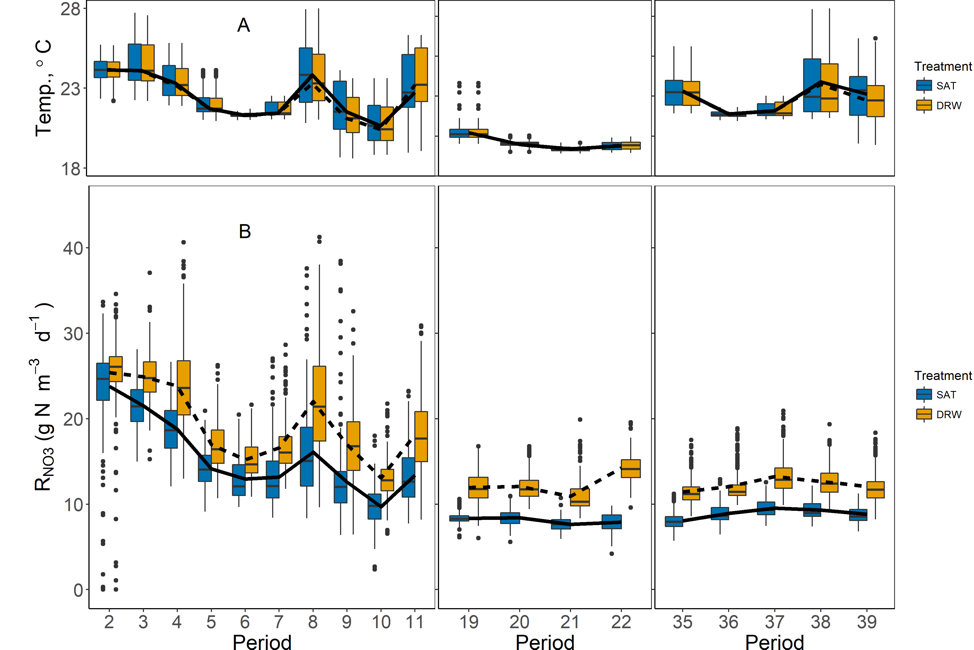
<br/><br/>
Box plots of temperature (A) and volumetric nitrate removal rates, RNO3, (B) for both DRW and SAT columns from Periods 2–11, 19–22, and 35–39 (Days 28–287). Dashed and solid lines indicate weekly means for each Period for DRW and SAT groups, respectively [@Maxwell2019-ht] 
</center>

<br/><br/>

Nitrate removal rates in DRW columns increased by up to 80%, relative to SAT columns, although DRW removal rates decreased quickly within 3 d after rewetting. Increased nitrate removal in DRW columns continued even after 39 DRW cycles, with ~33% higher total nitrate mass removed over each weekly DRW cycle. Data collected in this experiment provide strong evidence that DRW cycles can dramatically improve nitrate removal in woodchip bioreactors, with carbon availability being a likely driver of improved efficiency.

<br/><br/>

<center>
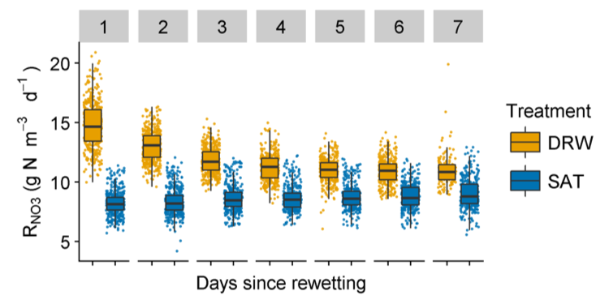
<br/><br/>
Boxplots of volumetric NO3 removal rates (RNO3) according to the number of days since the previous drying-rewetting (DRW) event (for Periods 19–22 & 35–39). Removal rates in DRW columns were ~80% greater than SAT columns on the first day after rewetting, with DRW RNO3 decreasing and eventually stabilizing ~4 days after rewetting [@Maxwell2019-ht]
</center>

<br/><br/>

### Increased Duration of DRW Cycles Increases Nitrate Removal in Woodchip Bioreactors

The 2018 lab experiment was a follow-up of the 2017 experiment designed to determine the effect of duration of unsaturated conditions on nitrate removal after rewetting. Three different levels of DRW duration were tested in the 105-d column experiment (n = 2), with woodchips left unsaturated once a week for either 2 h, 8 h, or 24 h. Increasing duration of unsaturated conditions significantly increased nitrate removal rates. The longest DRW duration of 24 h resulted in the greatest increase in nitrate removal rates, relative to constantly saturated woodchips, with mean rate increases reaching 172% by the end of the experiment. 

<br/><br/>

<center>
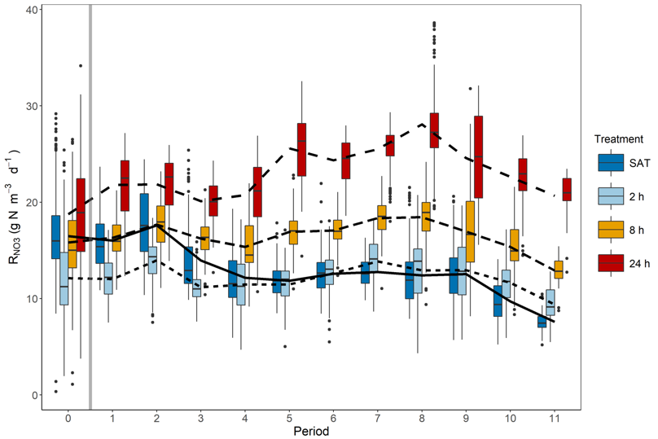
<br/><br/>
Box plots of volumetric nitrate removal rates (RNO3) during each weekly period, with Period 0 being the 33 d baseline period where all columns received the SAT treatment. The grey vertical bar indicates the beginning of DRW cycles [@Maxwell2019-ol]
</center>

<br/><br/>

### Nitrate Removal in Denitrifying Bioreactors is Carbon Limited

Results from the lab 2017 and 2018 experiments show that there was a strong correlation between the volumetric nitrate removal rates and the apparent DOC leaching rates in the columns, regardless of the treatment. This strongly suggests that nitrate removal in denitrifying bioreactors is carbon limited.

<br/><br/>

<center>

<br/><br/>
Nitrate removal rates plotted against DOC leaching rates. Nitrate removal was strongly correlated with LDOC, even in SAT columns not undergoing DRW cycles
</center>

<br/><br/>

### Carbon dioxide emissions proportional to the duration of DRW cycles

Quantifying the gaseous emission rates was not the easiest thing to do but we (Augustin Thomas), was able to show that the open chamber approach was satisfactory to measure CO~2~ and N~2~O emission rates. In the end we were able to show that the CO~2~ emissions had a clear typology where the emissions rose rapidly right after the draining of the column. There always was a large CO~2~ emission peak during the rewetting of the columns, likely corresponding to the flushing of accumlated gases in the then unsaturated woodchip. The data from the 24 h aerobic DRW cycle suggests that around 10 hours of exposure to aerobic conditions, an additional pulse of CO~2~occurred suggesting that the microbial activity increased at about this time.

<br/><br/>

<center>
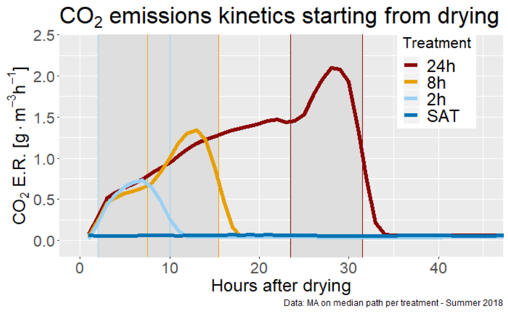
<br/><br/>
Typology of the CO~2~ emission rate dynamics during the drying and rewetting periods of the lab columns
</center>

<br/><br/>

Unfortunately, the dissolved CO~2~ was not measured and most of the apparent CO~2~ emissions correspond to the those observed in the gaseous phase, and these correspond to the several hours of drying and rewetting, hence the apparent larger CO~2~ emissions for the longer durations of DRW.

<br/><br/>

<center>
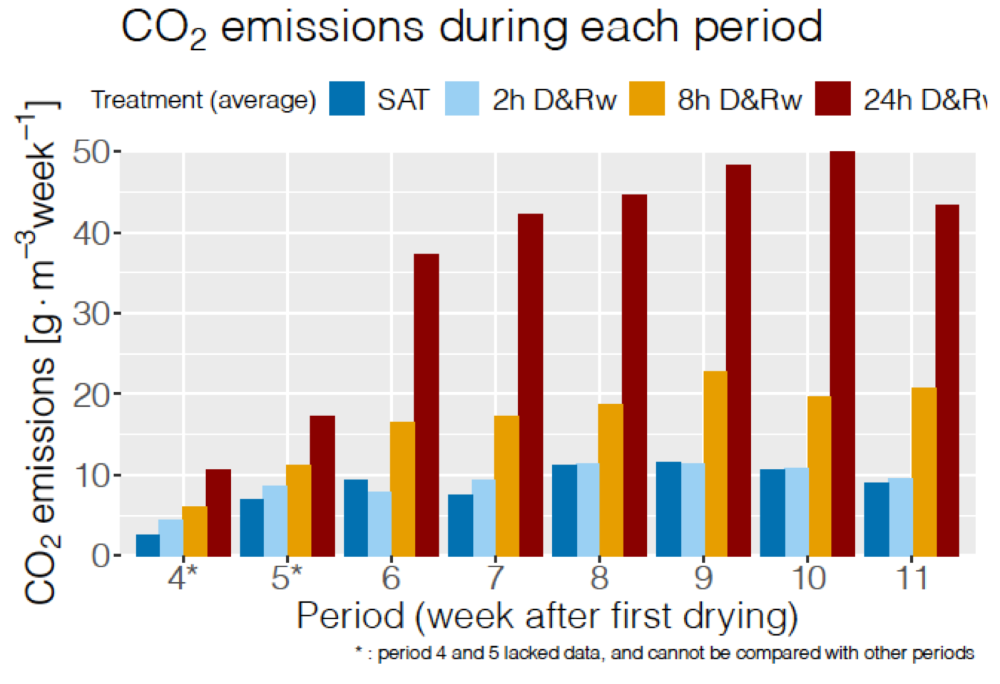
<br/><br/>
Weekly rates of gaseous CO~2~ emitted by the bioreactor columns during DRW cycles showing increasing emissions with increasing DRW cycle durations
</center>

### Low N~2~O gaseous emissions with DRW cycles

The N~2~O emissions observed in 2017 suggest that the 8 hr DRW cycles produced more N~2~O than the constantly saturated (SAT) columns. This could be due to the high solubility of N~2~O which in the case of the SAT columns would have remained dissolved while 8 hr of unsaturated conditions allowed N~2~O to be emitted in the gaseous phase. The DRW duration experiment in 2018 suggest to the contrary that the longer the DRW duration, the lower the N~2~O emissions

<br/><br/>

<center>

<br/><br/>
Weekly rates of gaseous N~2~O emitted by the bioreactor columns during DRW cycles showing decreasing emissions with increasing DRW cycle durations
</center>
<br/><br/>

Unfortunately, the dissolved concentration of N~2~O was not measured either and the total mass of N~2~O emitted by the bioreactor columns remains unknown but we ***were able to estimate that the N~2~O emitted in the gaseous form did not exceed 0.2% of the nitrate removed*** by the woodchip bioreactors. Our results also suggest that the DRW cycles appear to in the long run lower the N~2~O emitted by woodchip bioreactors.

<br/><br/>

### Microbial pathways derived from N~2~O isotopomer measurements

The different pathways for denitrification, hence for the production of N~2~O before it is reduced to N~2~, are thought to be accompanied with isotopic fractionation (Shearer and Kohl, 1988). Based on possible combination of nitrogen and oxygen isotopes, the asymmetric structure of N~2~O could result in five most abundant natural isotopomers: ^14^N^14^N^16^O,  ^14^N ^15^N ^16^O,  ^15^N ^14^N ^16^O,  ^14^N ^14^N ^17^O and  ^14^N ^14^N ^18^O [@Yoshida2000-nb]. The bulk nitrogen isotope ratio,  ^15^R^bulk^ = ( ^14^N ^15^N ^16^O +  ^15^N ^14^N ^16^O)/(2 &times; ^14^N ^14^N ^16^O), and oxygen isotope ratio,  ^18^R =  ^14^N ^14^N ^18^O/ ^14^N ^14^N ^16^O or  ^17^R =  ^14^N ^14^N ^17^O/ ^14^N ^14^N ^16^O, have been found to vary from different environments or N~2~O-producing processes [@Wahlen1985-in; @Yoshida1988-fm]. The differences in  ^15^R^bulk^ for N~2~O production of denitrification process are because reduction of N~2~O to N~2~ favors  ^14^N, leading to enrichment of  ^15^N in the remaining unreacted N~2~O [@Barford1999-ve; @Webster1996-xm].

<br/><br/>

<center>

<br/><br/>
A- Microbial pathways resulting in isotopic fractionation of N~2~O [@TOYODA2015]; B- Microbial pathway signature in a SP = f(&delta;^15^N^bulk^) [@TOYODA2011]
</center>
<br/><br/>

The nitrogen isotope ratio, ^15^R^&alpha;^ = ^14^N^15^N^16^O/^14^N^14^N^16^O and ^15^R^&beta;^ = ^15^N^14^N^16^O/^14^N^14^N^16^O, can be used to calculate ^15^N-site preference (SP), SP = ^15^R^&alpha;^ - ^15^R^&beta;^. Many studies have shown that different N~2~O-producing groups have distinct ^15^N-SP. Toyoca et al. [-@TOYODA2011] have suggested that microbial pathway signatures can be plotted in a SP = f(&delta;^15^N^bulk^) space.

<br/><br/>

<center>

<br/><br/>
The pathway, while a little chaotic concerning its “Saturated” part, shows a clear shift in Site Preference from -5‰ to +40‰, concurrent with an increase quickly followed by a decrease of the bulk ratio, giving (more or less depending on the week) a semi-circle shape to the pathway (Column 8, week 3 (A) and 9 (B).
</center>
<br/><br/>

Using the procedure proposed by Toyoca et al. [-@TOYODA2011], we created a centroid model where we considered denitrification, nitrification and reduction. The apportionement of each of this processes is calculated as a function of the location on the data points on the SP = f(&delta;^15^N^bulk^) space. The relative apportionement (the sum of three equals one) is illustrated in the figure below. It clearly shows the shift from denitrification to nitrification, concurrent with the increasing importance of reduction. This shift does not happen at the same time depending on the week number, which hints at a evolution in the microbial population over the weeks.

<br/><br/>

<center>
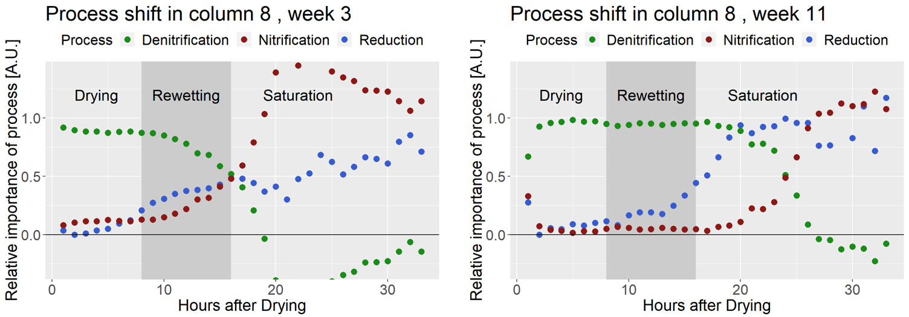
<br/><br/>
**Relative** apportionment of denitrification, nitrification and N~2~O reduction during DRW cycles. Notice the shifts that occurred in 8 weeks
</center>
<br/><br/>

The same data multiplied by the emission rates show an overall predominance of denitrification in the production of N~2~O during the drying and rewetting cycles. However, some of the N~2~O appears to be emitted through nitrification, possibly as a response to the intermittent aerobic conditions.

<br/><br/>

<center>
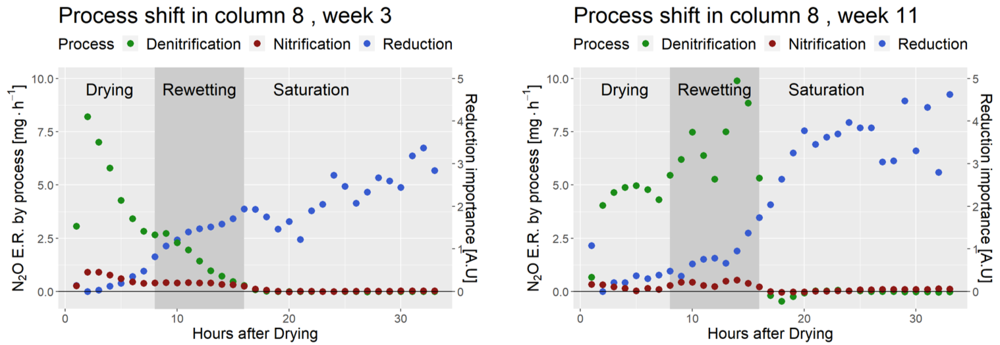
<br/><br/>
**Absolute** apportionment of denitrification, nitrification and N~2~O reduction during DRW cycles. Notice the shifts that occurred in 8 weeks
</center>
<br/><br/>


### Very Small Porewater Velocity may Limit Nitrate Removal in Denitrifying Bioreactors

The 76-d experiment quantifying the impact of porewater velocity and lead by Sam Blackman involved pumping nitrated waters through the columns at variable rates resulting in variable porewater velocities throughout the columns. The hypothesis was that increased porewater velocities would increase removal rates, as it was hypothesized that mixing in the column would lower the nitrate diffusion limitation at the microsite level. The results show a mild limitation of the porewater velocity to limit nitrate removal rates (unpublished results). 

<br/><br/>

<center>

<br/><br/>
Nitrate removal rates as a function of pumping rates showing a slight limitation at pumping rates lower than 0.25 ml/s
</center>

<br/><br/>

## Result highlights from field experiments
### High-frequency, *in situ* sampling of field woodchip bioreactors revealed sources of sampling error

The high frequency concentration and flow data at the in- and outlets of the IA and NZ bioreactors were resampled to simulate traditional methods of quantifying bioreactor performance in the field. These mostly rely on low-frequency, time-based (weekly to monthly sampling interval) or flow-weighted sample collection at the inlet and outlets. 

The results suggest that nitrate removal rates calculated from infrequent sampling of simultaneous in- and outlets are fraught with large uncertainties. Simulations revealed significant differences between the reference rates calculated from high-frequency data and those that would be obtained using traditional methods. Using traditional methods, the calculated nitrate removal rates could be twice overestimated or underestimated by less than half the actual ones. When sampling during events, percentage removal rates could be calculated to as low as 50% or as high as 95%, blurring the information reported.

<br/><br/>

<center>
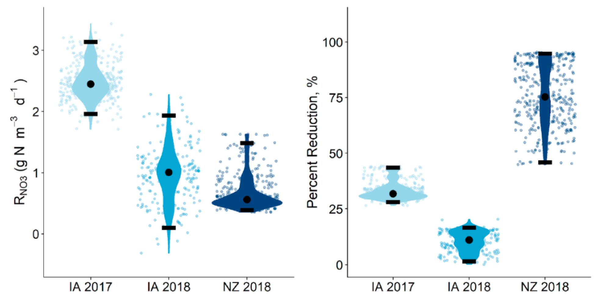
<br/><br/>
Probability distributions of the nitrate removal that would have been calculated from traditional infrequent sampling methods expressed as volumetric nitrate removal rates (left), and percent reduction (NZ) for the IA and NZ bioreactors. Horizontal black bars indicate the 2.5 and 97.5%iles and black circles indicate the median. Points of the same color indicate all measurements made during each respective monitoring period. All bioreactors showed variability in measured values, with the highest variability in measured percent reduction seen at the NZ bioreactor. 
</center>

<br/><br/>

### High-frequency, *in situ* sampling unveiled magnitude in concentration lag between in- and outlet

The nitrate concentration time series at the inlet and outlet, and in the wells of the NZ bioreactor in particular show the migration of nitrate pulses associated with flow peaks. This shows that the apparent chemographs change dramatically depending on where the sampling is done. 

<br/><br/>

<center>

<br/><br/>
Animation of the nitrate concentration time series obtained along the NZ bioreactor in August 2018, showing the propagation of the nitrate pulse associated with an hydrological event
</center>

<br/><br/>

It also shows that the nitrate peaks at the inlet and outlets in this bioreactor were lagging by about 3 days, showing that the hypothesis of steady state conditions must be met to use traditional methods of sampling, or gross errors may ensue in the interpretation of the result. Indeed, nitrate removal rates calculated during peak flow at the inlet, which would be associated with a nitrate peak, would result into calculating a large apparent removal rate. Sampling at the time when the nitrate would peak at the outlet would suggest that the apparent removal rate would be much lower for a much lower flow rate. In the end, one would conclude, most likely falsely, that the removal rates are positively correlated with flow rates, which is not possible since this would correspond to the lowest residence times.

<br/><br/>

<center>
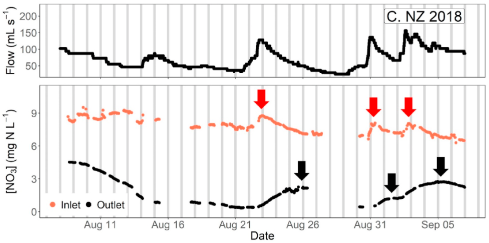
<br/><br/>
Time series of [NO3] for the NZ bioreactor showed lags between peaks of inlet [NO3] (red arrows) and outlet [NO3] (black arrows) of 2–3 days. Grey bars indicate 24 h intervals at midnight of each day.
</center>

<br/><br/>

### High-frequency, *in situ* sampling of field woodchip bioreactors revealed hydraulic inefficiencies

Nitrate concentration time series from a nitrate pulsed addition in the IA bioreactor in April 2017 showed that in this 8 year old bioreactor, the hydraulic conductivity was likely limited at the bottom of the bioreactor as the nitrate pulse did not reach the lower layers nearly as fast as it did in the shallow part of the bioreactor. This was attributed to the accumulation of finer woodchip residue at the bottom of the bioreactor. The effective volume participating in nitrate removal is thus less than the woodchip volume. Over time the active nitrate removing volume is expected to shrink, likely explaining in part the general observed decrease over time of nitrate removal capacities of aging bioreactors.

<br/><br/>

<center>
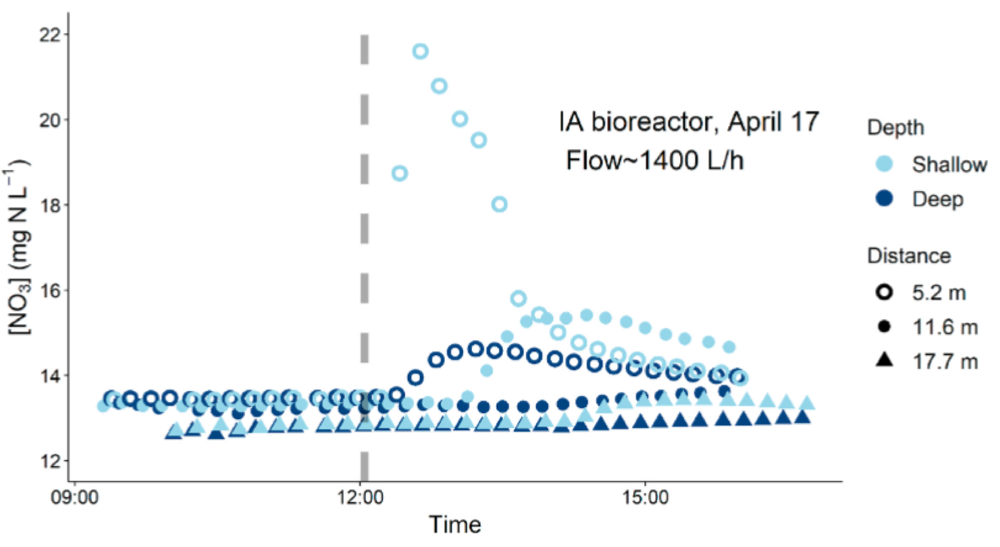
<br/><br/>
Time series of [NO3] in the IA bioreactor following a KNO3 injection (dashed grey line) at low flow. Peak in [NO3] at 5.2 m was higher in the shallow well, relative to the deep well, and passed more quickly through it. Increases in [NO3] in the shallow wells at 11.7 and 17.7 m were greater and arrived sooner than [NO3] increases in deep wells at the same distance from the inlet
</center>

<br/><br/>

## Modeling Result highlights

The lab experiments were specifically designed to quantify the effects on denitrification rates of drying-rewetting cycles where normally saturated woodchips were exposed to weekly unsaturated aerobic conditions that lasted 0, 2, 8, and 24 hours. Given the experimental settings, volumetric nitrate removal rates were best described by combining a Q~10~ function for temperature, a Michaelis−Menten function describing labile carbon availability, and an exponential function describing the negative impact of hydraulic residence time (HRT). 

<br/><br/>

<center>
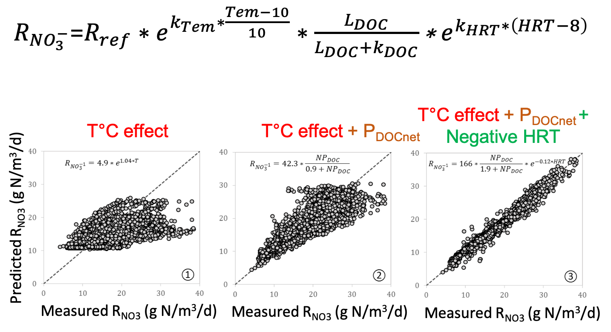
<br/><br/>
Goodness of fit between model and observed along a sequence of predictors: temperature only, temperature + the apparent release of DOC, and temperature + the apparent release of DOC + a negatice HRT effect
</center>

<br/><br/>

Results show that the calibrated kinetic model was able to predict the nitrate removal rates for all treatments with high accuracy in model calibration and validation periods.  The model performed worse during the model validation period in treatments with longer durations of unsaturated conditions. The thousands of data points available for comparison revealed a temporal evolution in the cumulative model bias. 

Our hypothesis is that the negative exponential effect of the hydraulic residence time appears as a proxy describing the negative effect of yet to be defined biochemical factors which accumulation over time may be correlated with HRT in woodchip bioreactors. This modeling analysis reveals, however, that the algorithms chosen did not fully satisfactorily take into account the probable physical and biochemical internal changes of the bioreactors occurring over time both in columns under constant saturation and those undergoing weekly drying-rewetting cycles. Findings from this study are useful for future mechanistic models of nitrate removal in woodchip bioreactors and provide insights into the interactions among internal factors affecting performance of woodchip bioreactor.

<br/><br/>

## Project Summary

<br/>

This project supported and/or provided the research basis for Bryan Maxwell and Wenlong Liu's Ph.D., and for Augustin Thomas' equivalent of MS. This project partly supported the PostDocs of Drs. Lamyaa Negm and Shying Tian. The project gave undergraduate research opportunities for Sam Blackman, Caleb Ray, and Mallory Alman. The projet involved PIs from five different institution, including four universities and a the US EPA. The project also helped launch the MultiplexÔ, LLC company. 

This project was transformative in many ways as it showed the crucial importance of high frequency water and air quality data. In particular, it is thanks to the high resolution data that in the lab:

- We could show that DRW cycles have a definitive effect on nitrate removal in bioreactors
- We could show that the longer the duration of aerobic conditions during DRW cycles, the larger the DRW effects on denitrification
- We could show that denitrification rates in the bioreactor columns tested were carbon limited, but that the observed rates could be best modeled using temperature, apparent DOC leaching, and a negative impact associated with residence time
- We could show that the DRW cycles appeared to be associated with minor release of gaseous N~2~O

The implication of this part of our research suggests that DRW cycles may be used as a management to rejuvenate woodchip bioreactors to help them maintain or boost their nitrate removal efficiency. DRW cycles seem to be associated with an increase in mineralization and release of labile carbon. As a result, carbon is consumed at a faster rate, which implies that woodchip bioreactors may have to be fed with woodchips more often.

It is also thanks to the high resolution data that in the field:

- We were able to show that traditional sampling methods involving biweekly or monthly simultaneous in- and outlet sampling may result in large errors in the reported rates
- We were able to show that within field bioreactors, the flow field may be highly heterogeneous as small particles accumulate at the bottom, hydraulic inefficiencies result, diminishing the effective denitrifying volume.

The modeling results also suggest that process-based modeling of as simple systems as woodchip bioreactor columns is far from simple and that there is still much to uncover to have a chance to model denitrification rates in these systems, let alone in much more complicated systems such as soils.

<br/><br/><br/><br/>

## Publications associated with this project

<br/>

```{r echo=FALSE, results="asis",comment=FALSE}

library(RefManageR)

file_journals_EN <- ReadBib("journal_articles_WB.bibtex")
art_nb_EN <- length(file_journals_EN)


file_journals <- file_journals_EN
dates <- unlist(unique(file_journals$year))[order(unlist(unique(file_journals$year)),decreasing = TRUE)]

# make a list for numbering, but inactive as of October 2017
inc_nb<-art_nb_EN
art_list<-list()
for (date in dates) {
  i=1
  yart_nb<-sum(sapply(file_journals_EN[list(year=date)],length))
  art_list[[date]] <- as.vector((inc_nb):(inc_nb - yart_nb + 1))
  art_list[[length(art_list) + i-1]] <-art_list[[date]]
  inc_nb = inc_nb - yart_nb
}

#Prints references
for (date in dates) {
#  cat(paste0("## ",date),"\n")
  print(file_journals[list(year=date)],.opts = list(style="markdown",bib.style ="authoryear" ,max.names =20,dashed=FALSE,no.print.fields = "issn"))
  cat("\n")
}

```

<br/><br/><br/><br/>

# References 
