```{r setup, include=FALSE, eval=TRUE}

knitr::opts_chunk$set(echo = TRUE)
major=read.table("RMarkdown_Aug.csv",header=TRUE,sep=",")
major$Treatment=as.factor(major$Treatment)
major$Column=as.factor(major$Column)
major$PeriodDay=floor(major$PeriodTime)
height=4
width=6
require(pander)
require(ggplot2)
require(ggsignif)
require(pls)
library(xts)
require(citr)
require(zoo)
require(DT)
periods=c(0,1,2,3,4,5,6,7,8,9,10,11,19,20,21,22)
lay_out = function(...) {    
  x <- list(...)
  n <- max(sapply(x, function(x) max(x[[2]])))
  p <- max(sapply(x, function(x) max(x[[3]])))
  grid::pushViewport(grid::viewport(layout = grid::grid.layout(n, p)))    
  
  for (i in seq_len(length(x))) {
    print(x[[i]][[1]], vp = grid::viewport(layout.pos.row = x[[i]][[2]], 
                                           layout.pos.col = x[[i]][[3]]))
  }
} 
```

## Literature: DRW have an impact on soil and bioreactor metabolism

--

- Drying-Rewetting (DRW) cycles in soils have a metabolic effect [@beare2009; @borken2009; @xiang2008; @ruser2006; @miller2005]

--

- Several orders of magnitude increase in $N_{2}O$ production following rewetting of a dry low C soil (1.4-1.7%); due to denitrification [@ruser2006]

--

- DRW cycles increased C and N release by 18 and 10%, respectively, relative to soil cores (2.4% C content) 

--
 
- N release increased with the frequency of DRW cycles [@miller2005]

--

- DRW cycles reduce microbial biomass and fungal:bacterial ratios, while increasing the amount of microbial activity and dissolved inorganic N in soil leachates [@gordon2008]

--

- nitrate removal in woodchip columns increased from 48 to 90% following a single 96 hr DRW event [@christ2017]

---

## Identified gaps in the literature

--

- how DRW cycles affect C and N turnover rates in high C content media?

--

- long-term impact of regular DRW cycles on these turnover rates ?

---

## Research questions of the column study

--

- Is it possible to rejuvenate/enhance woodchip bioreactor nitrate removal capacities with DRW cycles? and by how much?

--

- Can we quantify the relative and absolute impact of the drivers of nitrate removal in woodchip bioreactors (T°C, HRT, DOC)?


---

## Method

--

- 50 cm x 15 cm diameter columns containing aged woodchips from a field bioreactor

--

- 8 columns exposed to prolonged saturation or weekly DRW cycles

--
    - 4 control (always saturated): SAT
    - 4 columns undergoing weekly 8-hour drained to equilibrium: DRW

--

- inlet water: stock tank containing nitrate-spiked tap water (~20 mg $NO_{3}$-N/L)

---

## Experimental setup


.center[
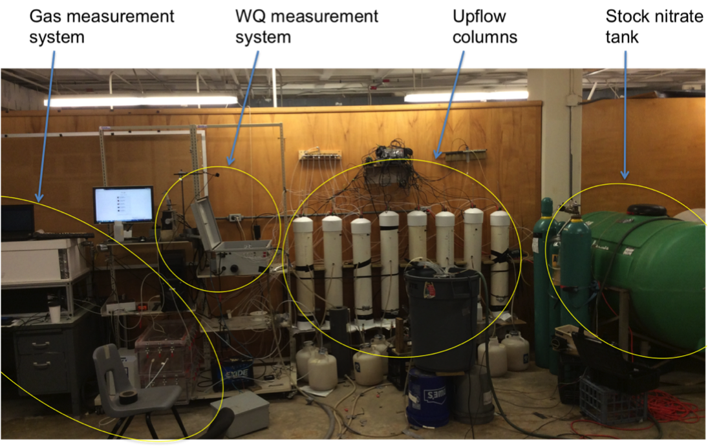
]

---

## Column setup

.center[
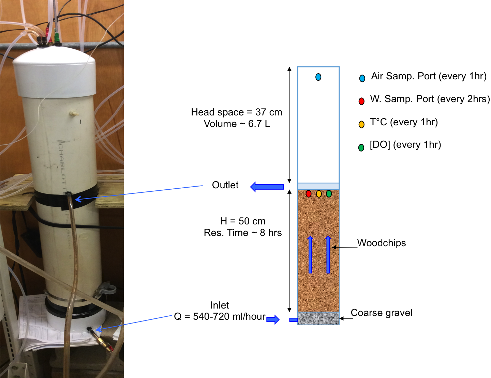
]

- Water can be drained at bottom for the 4 DRW
---

## Stock nitrate tanks

.center[
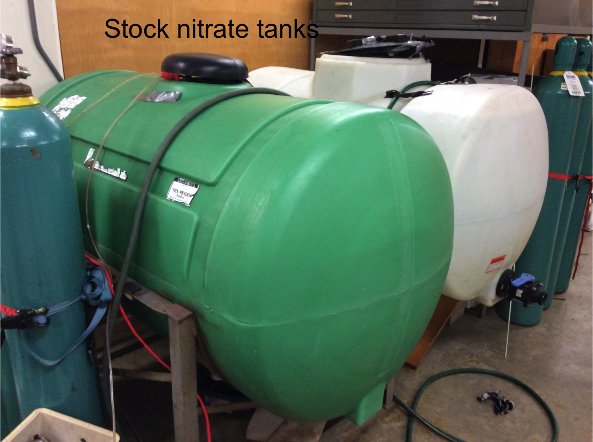
]

---

## Steady input flow

.center[
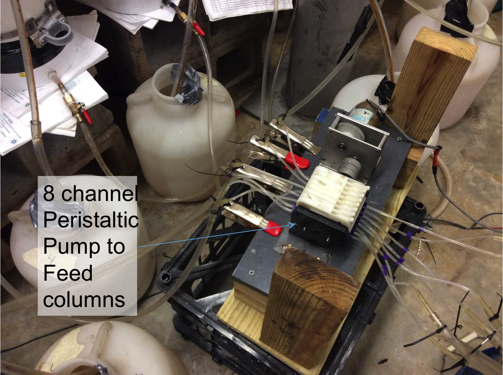
]

---

## Sensing DO and T°C using PreSens sensors in columns

.center[
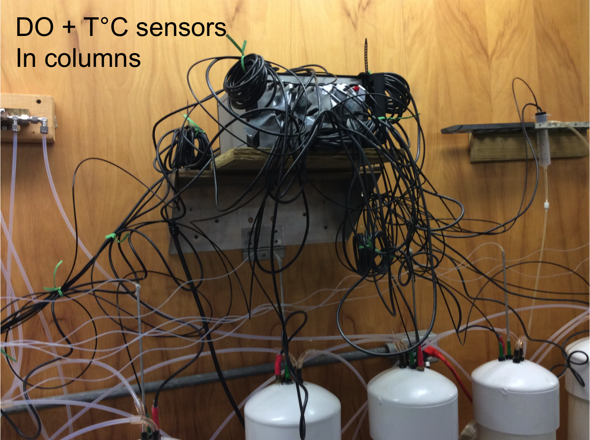
]

---

## Sensing DO and T°C from stock tank water

.center[
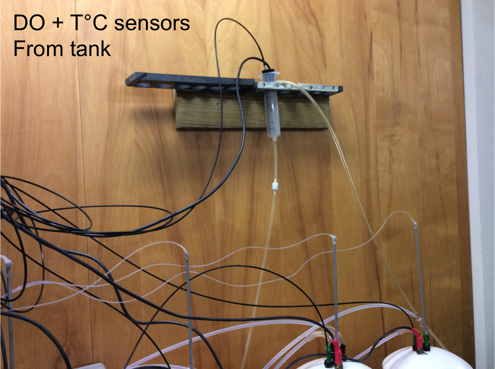
]

---

## Sensing DO and T°C from stock tank water

.center[
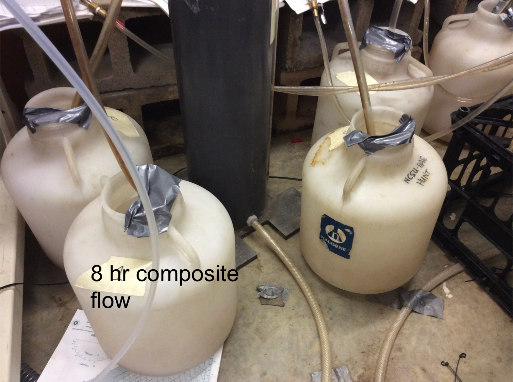
]

---

## Sensing nitrate and DOC using spectrophometer

.center[
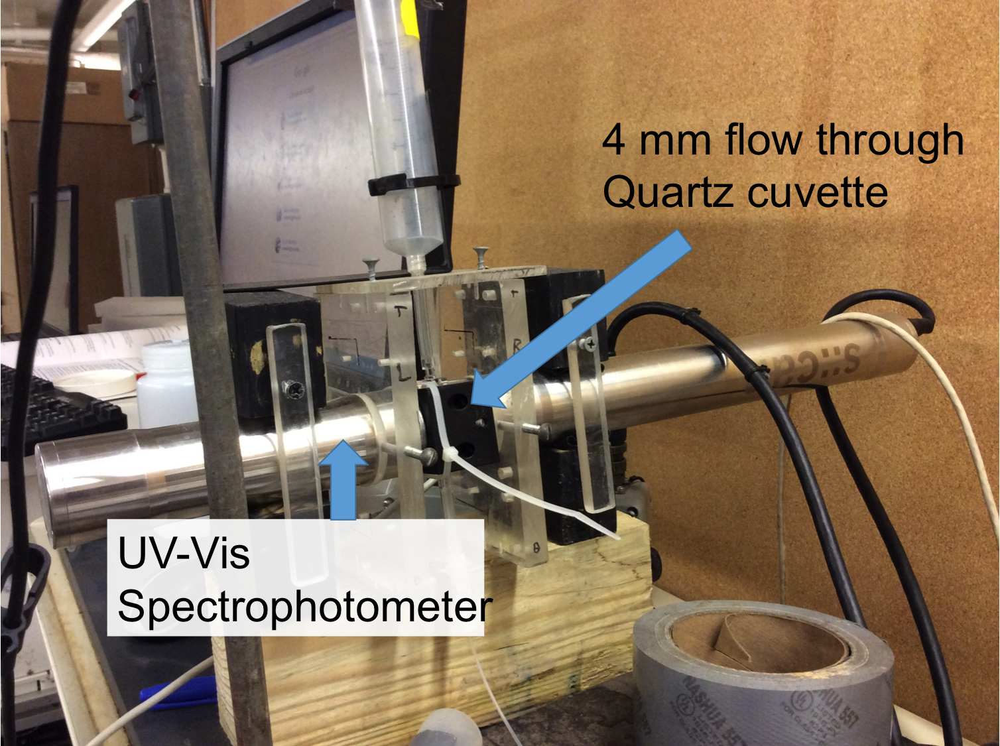
]

---

## Auto-sampling column water to Spectrophotometer

.center[
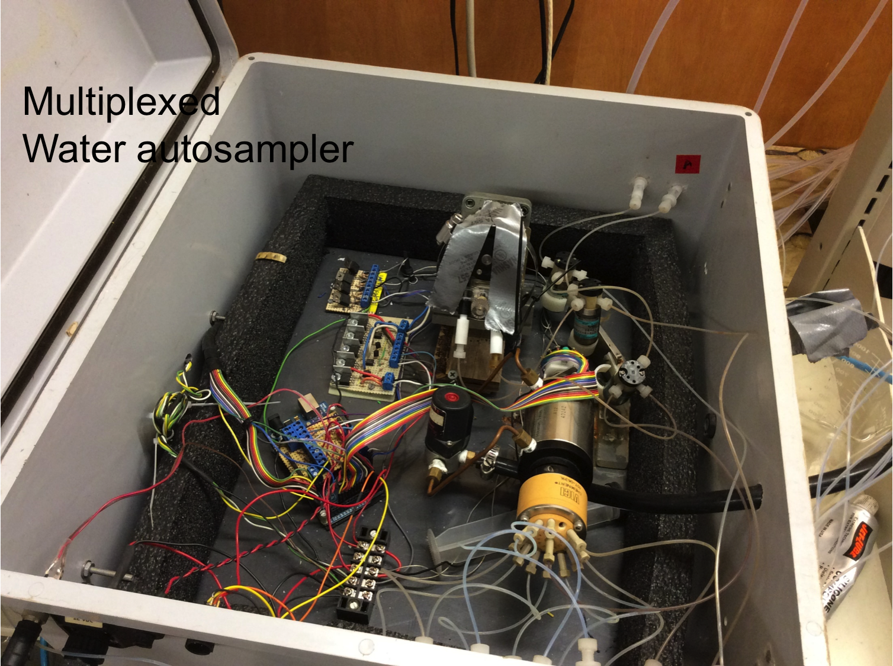
]

---

## Gas measurements system

.center[
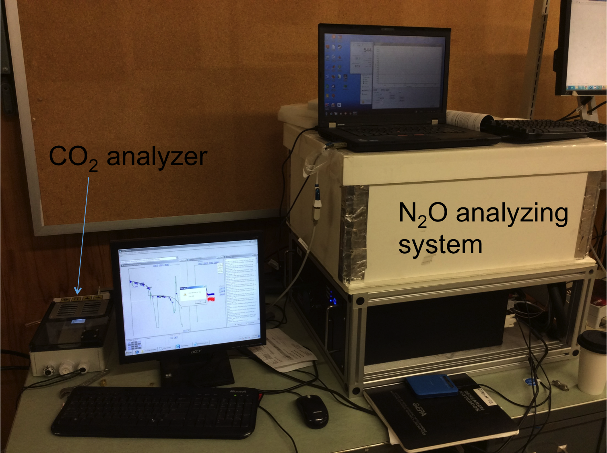
]

---

## 16-way valve for sampling head space gases

.center[
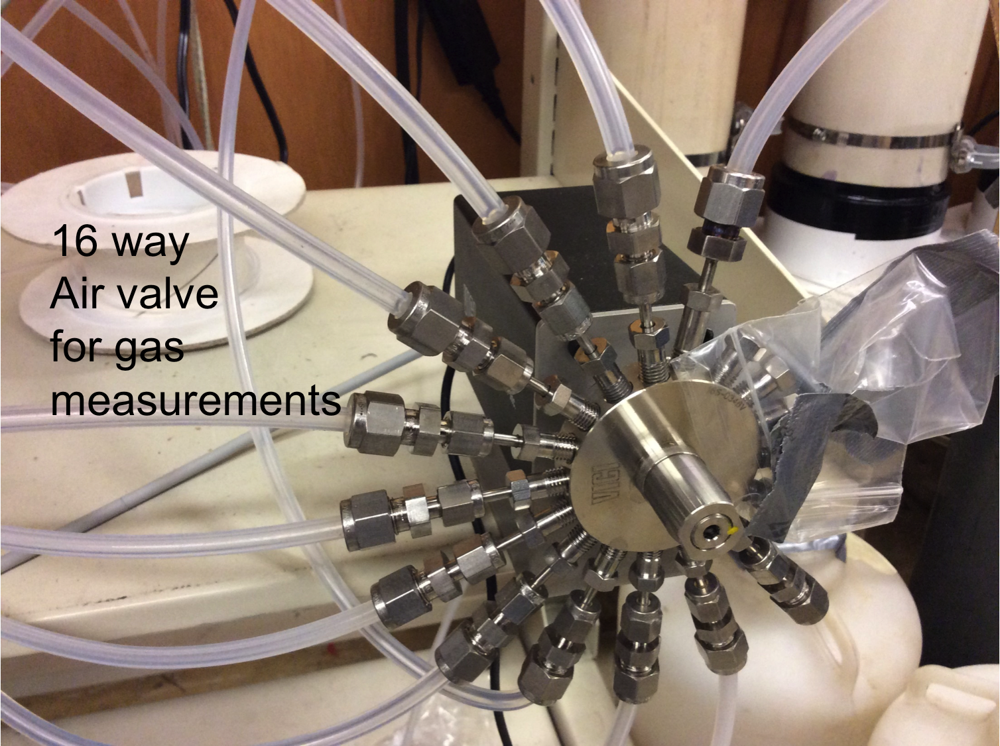
]

---
## Nitrate removal rates

- Nitrate removal rates calculated as:

$$R_{NO_{3}} =  \frac{([NO_{3}]_{in}-[NO_{3}]_{out})*Q}{V}$$
- where 
    - `Q` is the flow rate
    - `V` is the is the total woodchip-filled portion of the column based (0.009 m^3^) and not the total porosity
    - Overall unit is g/m3/d of bioreactor

---
## DOC production rates

- Nitrate removal rates calculated as:

$$P_{DOC} =  \frac{([DOC]_{out}-[DCO]_{in})*Q}{V}$$
- where 
    - `Q` is the flow rate
    - `V` is the is the total woodchip-filled portion of the column based (0.009 m^3^) and not the total porosity
    - Overall unit is g/m3/d of bioreactor

---
## Overall Concentration plot

.center[
```{r,echo=FALSE,warning=FALSE,cache=TRUE}
drains=seq(21.583,180,7)
plotmargin=c(.1,.05,.1,0.05)
axis.title=12
legend.text=10
axis.text=10
cbbPalette=c("#000000", "#009E73", "#e79f00", "#9ad0f3", "#0072B2", "#D55E00", "#CC79A7", "#F0E442")
tankerNO3=subset(major,Column==1)
ggplot(major,aes(x=Day,y=NO3calib,color=Treatment))+
  geom_vline(xintercept=drains,linetype="solid",color="grey40",size=2,alpha=0.3)+
  geom_point(size=1)+
  theme_bw()+
  scale_color_manual(name="Treatment",breaks=c(0,1),labels=c("SAT","DRW"),values=c(cbbPalette[5],cbbPalette[3]))+
  theme(plot.margin=unit(plotmargin,"cm"))+
  theme(axis.title=element_text(size=axis.title),axis.text=element_text(size=axis.text))+
  theme(legend.text=element_text(size=legend.text),legend.title=element_text(size=legend.text))+
  labs(y="Outlet NO3-N (mg/L)")+
  scale_y_continuous(breaks=seq(0,20,5),limits=c(0,22))+
  #scale_x_continuous(breaks=seq(70,100,1),limits=c(70,100))+
  scale_x_continuous(breaks=c(0,20,40,60,80,100,120,140,160,180))+
  geom_point(data=tankerNO3,aes(x=Day,y=TankNO3calib),color="black",show_legend=TRUE,size=1)+
  geom_point(data=tankerNO3,aes(size="Inlet \nNO3",shape=NA),colour="black")+
  guides(size=guide_legend("",override.aes=list(shape=16,size=2)))+
  guides(color=guide_legend("Treatment",override.aes=list(shape=16,size=2)))
```
]

---
## Distinct biogeochemical periods

--

- Outlet conc. was considerably affected by time, column flow rate, and temperature, with the most variability during Days 0 - 100

--

- From Day 1 - 11 (Period 0), $[NO_{3_{out}}]$ were high with very little apparent removal
    - mean $[NO_{3_{out}}]$ for SAT and DRW columns were 17.6 and 17.4 mg/L

--

- After this initial period there was a rapid decrease in outlet $[NO_{3_{out}}]$, continuing to decrease through Days 30-34

--

- Days 20 - 50 (Periods 1 - 4): $[NO_{3_{out}}]$ = 6.3 and 5.7 mg/L for SAT and DRW columns

--

- $[NO_{3_{out}}]$ slowly increased through Days 50-70 (Periods 5-7)

--

- Sudden decreases in all columns occurred around Days 76 & 96 ( $[NO_{3_{out}}]$ below 2.5 mg/L)

--

- Days 50-100: $[NO_{3_{out}}]$ 13.3 and 11.6 mg/L for SAT and DRW columns

--

- Days 147-171 (Periods 19-22): variability in outlet conc. greatly decreased; $[NO_{3_{out}}]$ SAT and DRW columns during this time were 16.7 and 14.7 mg/L

---

## Nitrate removal rates

.center[
```{r,echo=FALSE,warning=FALSE,cache=TRUE}
sack=subset(major,major$Day>1.2)
a1=ggplot(sack,aes(x=Day,y=VolumetricRate,colour=Treatment))+
  geom_vline(xintercept=drains,linetype="solid",color="grey40",size=2,alpha=0.3)+
  geom_point(aes(x=Day,y=VolumetricRate,colour=Treatment),size=1)+
  theme_bw()+
  scale_color_manual(name="Treatment",breaks=c(0,1),labels=c("SAT","DRW"),values=c(cbbPalette[5],cbbPalette[3]))+
  theme(plot.margin=unit(plotmargin,"cm"))+
  theme(axis.title=element_text(size=axis.title),axis.text=element_text(size=axis.text))+
  theme(legend.text=element_text(size=legend.text),legend.title=element_text(size=legend.text))+
  labs(y=expression("Removal Rate (g N/"~m^3~"/d)"))+
  scale_x_continuous(breaks=c(0,20,40,60,80,100,120,140,160,180))
tempy=subset(major,major$Column==1)
a2=ggplot(tempy,aes(x=Day,y=Temp))+
  geom_vline(xintercept=drains,linetype="solid",color="grey40",size=2,alpha=0.3)+
  geom_point(color="#D55E00",aes(shape="Temp"),size=1)+
  theme_bw()+
  labs(y=expression("Temp. ("~degree*C~")"))+
  theme(plot.margin=unit(plotmargin,"cm"))+
  theme(axis.title=element_text(size=axis.title),axis.text=element_text(size=axis.text))+
  theme(legend.text=element_text(size=legend.text),legend.title=element_text(size=legend.text))+
  scale_y_continuous(breaks=c(20,24,28))+
  #scale_y_continuous(breaks=seq(18,24,1))+
  scale_x_continuous(breaks=c(0,20,40,60,80,100,120,140,160,180))+
  #scale_x_continuous(breaks=seq(147,172,2),limits=c(147,172))+
  guides(shape=guide_legend("",override.aes=list(shape=16,size=2)))
lay_out(list(a1,3:7,1:2),
        list(a2,1:2,1:2))
  
```
]

T°C variability from Days 0-100 was high, with less variability during Period 19-22. T°C differences between columns was low (mean difference <0.4°C). Removal rates at Day<1.2, during initial flushing of columns, is not shown.

---

## General nitrate removal rate fluctuations

--

- High variability in temperature and flow rates resulted in significant noise in $[NO_{3_{out}}]$

--

- Noise only moderately decreased when normalizing by flow

--

- The trends in removal rates are similar but counter-directional to the trends in $[NO_{3_{out}}]$
    - supporting three distinct periods were occurring within the first 100 days. 
    - Removal initially low from Day 0-11, 
    - Increasing rapidly through Day 20, 
    - and subsequently decreasing Days 70-100. 
    
--

- During Days 20-50 mean removal rates were 21.4 and 23.1 $g N/m^3/d$ for SAT and DRW 

--

- decreasing to 13.6 and 18.5 $g N/m^3/d$ during Days 70-100. 

---

## Possible explanations for observations

--

- Low removal rates from Days 0-11 was most likely due to acclimation of the microbial community
    - Gungor-Demirci and Demirer (2004) saw microbial acclimation in an anaerobic digester took 3-5 days until gas production occurred 
    - Horiba et al. [-@horiba2005] found that steady-state conditions for denitrifiying bacteria in culture did not occur until 80 days after inocculation. 
    
--

While the woodchips were obtained from a field bioreactor, the water chemistry for the experiment was dramatically different from the sprayfield effluent leaving the tile drainage and may have required an adjustment by the microbial community. 

---

## DW cycles significantly enhance nitrate removal

--
 
- Differences in SAT and DRW column removal rates was determined using a two-sample t-test

--

- Besides periods 0 and 1, **Significant difference** between SAT and DRW

--

```{r, echo=FALSE, cache=TRUE}
dry=subset(major,Treatment==1)
wet=subset(major,Treatment==0)
ttest=function(i){
  #i=6
  dec=3
  nsmall=3
  #i=1
  dry_set=subset(dry,dry$Period==i)
  wet_set=subset(wet,wet$Period==i)
  d=na.omit(dry_set$VolumetricRate)
  w=na.omit(wet_set$VolumetricRate)
  ttest=t.test(d,w,conf.level=0.95,var.equal=FALSE)
  p=format(round(ttest$p.value,3),nsmall=nsmall)
  low=ttest$conf.int[1]
  high=ttest$conf.int[2]
  lowv=format(low,digits=dec,nsmall=nsmall)
  highv=format(high,digits=dec,nsmall=nsmall)
  lowu=format(round(low,dec),nsmall=nsmall,digits=3)
  highu=format(round(high,dec),nsmall=nsmall,digits=3)
  
  tester=c(format(round(mean(d),dec),nsmall=nsmall),format(round(mean(w),dec),nsmall=nsmall),
          paste0(lowu," , ",highu),format(round(mean(d),dec),nsmall=nsmall),
          format(round(mean(w),dec),nsmall=nsmall),
          paste0(lowv," , ",highv),p)
  
  return(tester)
}
now=lapply(periods,ttest)
nower=do.call(rbind,now)
colnames(nower)=c("DRW\nRemoval\n(g N/d)","SAT Mean Rem. Rate\n(g N/d)","95% CI for Diff\nin Means",
                     'DRW\nVol Rate\n(g N/m2/d)','SAT\nVol Rate\n(g N/m2/d)',
                     'Diff in Means\n(g N/m2/d)',"p-value")
rownames(nower)=c(paste0("Period ",periods))
DT::datatable(
  nower[,4:7],
  fillContainer = FALSE, options = list(pageLength = 3, fontSize = '50%')
) #%>%
  #DT::formatStyle(columns = colnames(.), fontSize = '50%')
#knitr::kable(nower, format = "html")
#rownames(nower)=c(paste0("Period ",periods))
#  pander(nower[,4:7],caption="Mean volumetric removal rates for SAT and DRW groups across #periods. p-value indicates significant difference in group means at 95% #confidence",keep.line.breaks=TRUE)

```


---

---

## DW cycles significantly enhance nitrate removal
### Removal rates in DRW ~20% to ~40% higher

--

- % difference between SAT and DRW grew over time

--

- In Periods 2-4, mean removal rates were 6-24% higher in DRW columns, relative to SAT

--

- In Periods 19-21, DRW removal rates were greater by 42-43%

--

- In Period 22 DRW removal rates were higher by 73-83% (however data was only collected during the first 3 days of Period 22 due to instrument error)

---

## Short-term patterns of enhanced nitrate removal

- Diff between DRW and SAT diminishes days 1-3, then stable day >4 after rewetting
- Overall average rates values boosted by high rates just after rewetting

.center[
```{r,echo=FALSE,warning=FALSE,cache=TRUE,fig.cap="Comparison between SAT and DRW volumetric removal rates, according to the number of days since the previous drain/rewetting event. Differences between groups decreased over time. *** indicate significant differences in group means."}
case=subset(major,Period>18)
case$PeriodDay=as.factor(case$PeriodDay)
label=c('0'="1 day",'1'="2 days",'2'="3 days",'3'="4 days",'4'="5 days",'5'="6 days",'6'="7 days")
case$PeriodDay=factor(case$PeriodDay,levels=c(0,1,2,3,4,5,6))
case$Treatment=factor(case$Treatment,levels=c(1,0))
case=subset(case,Treatment==1 | Treatment==0)
case=case[which(!is.na(case$PeriodDay)),]
#case=na.omit(case$Treatment)
ggplot(case,aes(x=Treatment,y=VolumetricRate,group=Treatment))+
  geom_boxplot(aes(fill=Treatment))+
   theme(axis.text.x=element_blank())+
  scale_fill_manual(labels=c("DRW","SAT"),values=c(cbbPalette[3],cbbPalette[5]))+
  geom_signif(comparisons=list(c("0","1")),map_signif_level = TRUE)+
  facet_grid(.~ PeriodDay,labeller=as_labeller(label))

```
]


---

## Similar observations in the literature

--

- There are reports of increases in rates of carbon-fueled metabolic processes immediately after rewetting <span style="font-size:12px"> (Xiang et al., 2008; Ruser et al., 2005; Borken and Matzner, 2009)</span>

--

- Aerobic breakdown of organics and release of cellular compounds during unsaturated periods could increase C availability, increasing respiration or denitrification rates

--

- This would help explain initial bursts of activity immediately after rewetting, but does not address why rates were still higher 7 days later

--

    - columns appeared to flush completely in < 1 day
    
--

- Fully understanding what mechanisms are responsible for increased removal rates in DRW columns requries analysis of the carbon dynamics in the experiment

---

## Management considerations

--

- Do DRW benefits overweigh the intermittent lack of removal?

--

- Taking into account the intermittent no removal periods in the overall bioreactor removal capacity, it is possible to calculate the overall removal enhancement as a function of DRW frequency

--

.center[
```{r,message=FALSE,echo=FALSE,warning=FALSE,cache=TRUE,fig.cap="Increases in total $NO_{3}$ removed in DRW columns based on differences in daily means (red) and cumulative increased treatment (black) when considering untreated bypass while DRW columns were drained. The results indicate that increasing the DRW frequency to one drain every 2-3 days would provide the greatest overall improvement (~47%) in total nitrate removal.", fig.height=2.8}
wild=subset(major,Period>18 & Period<23)
dry=subset(wild,Treatment==1)
wet=subset(wild,Treatment==0)
wetmean=mean(wet$VolumetricRate,na.rm=TRUE)
y=matrix(NA,7,5)
x=matrix(NA,7,5)
for(i in c(1:7)){
  #i=2
  d=i-1
  dryd=subset(dry,PeriodDay==d)
  wetd=subset(wet,PeriodDay==d)
  #wmean=mean(wetd$VolumetricRate,na.rm=TRUE)
  if(i==1){
    dmean=mean(dryd$VolumetricRate,na.rm=TRUE)
    wmean=mean(wetd$VolumetricRate,na.rm=TRUE)+wetmean*0.33333
  } else {
    dmean=mean(dryd$VolumetricRate,na.rm=TRUE)+as.numeric(y[i-1,1])
    wmean=mean(wetd$VolumetricRate,na.rm=TRUE)+as.numeric(y[i-1,2])
  }
  y[i,1]=dmean
  y[i,2]=wmean
  y[i,3]=(dmean-wmean)/(wmean)*100
  #y[i,4]=(mean(dryd$VolumetricRate,na.rm=TRUE)-mean(wetd$VolumetricRate,na.rm=TRUE))/mean(wetd$VolumetricRate,na.rm=TRUE)*100
  y[i,4]="Total"
  y[i,5]=i
  x[i,1]=dmean
  x[i,2]=wmean
  x[i,3]=(mean(dryd$VolumetricRate,na.rm=TRUE)-mean(wetd$VolumetricRate,na.rm=TRUE))/mean(wetd$VolumetricRate,na.rm=TRUE)*100
  x[i,4]="Daily"
  x[i,5]=i
}
y=as.data.frame(y)
x=as.data.frame(x)
c=rbind(y,x)
colnames(c)=c("DRW.mean","SAT.mean","Percdiff","Type","Day")
c$Percdiff=as.numeric(as.character(c$Percdiff))
ggplot(c,aes(x=Day,y=Percdiff,colour=Type))+
  geom_point(size=4,show.legend=TRUE)+
  geom_smooth(aes(group=Type),span=.7)+
  scale_y_continuous(limits=c(0,100),breaks=seq(0,100,10))+
  scale_x_discrete(breaks=seq(1,7,1))+
  scale_colour_manual(values=c("black","red"),name="N Removal\nIncrease")+
  theme_bw()+
  theme(plot.margin=unit(plotmargin,"cm"))+
  theme(axis.title=element_text(size=axis.title),axis.text=element_text(size=axis.text))+
  theme(legend.text=element_text(size=legend.text),legend.title=element_text(size=legend.text))+
  labs(y=expression("Increase in " * NO[3] * "-N Removal (%)"),x="Days since rewetting or interval between drying events")
  
  #geom_point(data=y,aes(shape=NA,size="Total Eff."),size=4,colour="black")+
   #guides(color=guide_legend("tat",override.aes=list(shape=16,size=2)))

```
]
---

## Spectrophotometer probe calibration


```{r,warning=FALSE,echo=FALSE,eval = TRUE,cache=TRUE, fig.height=height,fig.width=width,fig.cap="Predicted vs. lab DOC "}
#values based on separate PLSR calibrations from manual samples collected on Days 14 and 29 (solid red points, Model 1) and Days 29, 40, and 45 (hollow black circles, Model 2). Black and red solid lines indicate linear regressions when predicting DOC conc. based on fingerprints taken on the same lab samples with which the model was built (i.e. using Model 1 to make prections from Day 14 & 29 fingerprints). Dashed lines indicate linear regression when predictions were made based on fingerprints taken during the alternate Model period (i.e. using Model 2 to make predictions from Day 14 and 29 fingerprints).

filename1<-"DOCcalib_prelim.csv"  #Specify file where flow data is located
chem<-read.csv(file=filename1,header=TRUE)
chem[,12:21]=NULL  #Take out useless columns
colnames(chem) <- c( 'Date.Time','Column', 'Status','Turb','Turbsig','NO3','NO3sig','TOC','TOCsig','DOC','DOCsig') #Add column names
colnames(chem)[12:(length(chem)-3)]<-c(seq(200,750,2.5))                      #Add column names
colnames(chem)[(length(chem)-2):length(chem)]=c("TANLab","NO3Lab","DOCLab")   #Add column names
dates2=format(chem$Date.Time,tz="GMT")
dates2=strptime(dates2,"%Y.%m.%d %H:%M",tz="GMT")
chem$Date.Time=dates2
labDOC=na.omit(chem$DOCLab)                                                   ##For PLSR, take out rows with no Lab Values
strike=chem[!is.na(chem$DOCLab),]                                              ##For PLSR calibration, keep only rows with 
strike=strike[,12:(length(strike)-9)]                                            ##For PLSR calibration, keep only 
#snake=chem[,12:(length(chem)-9)] 
labDOC1=labDOC[c(1:15)]
strike1=strike[c(1:15),]
labDOC2=labDOC[9:23]
strike2=strike[9:23,]
#labDOC3=labDOC[16:23]
#strike3=strike[16:23,]
DOCfit1=plsr(labDOC1~data.matrix(strike1),ncomp=2,validation="CV")               ##calibration for first sample period
DOCfit2=plsr(labDOC2~data.matrix(strike2),ncomp=10,validation="CV")               ##calibration for first sample period
DOCPfit1<-predict(DOCfit1,strike1,ncomp=2,type=c("response"))                 #Predict NO3-N concentrations for 
DOCPfit2<-predict(DOCfit2,strike2,ncomp=1,type=c("response"))
DOCPfit3<-predict(DOCfit1,strike2,ncomp=1,type=c("response"))
DOCPfit4<-predict(DOCfit2,strike1,ncomp=1,type=c("response"))
DOCreg1<-lm(labDOC1~as.matrix(DOCPfit1)) 
DOCreg2<-lm(labDOC2~as.matrix(DOCPfit2)) 
DOCreg3<-lm(labDOC2~as.matrix(DOCPfit3))
DOCreg4<-lm(labDOC1~as.matrix(DOCPfit4))
plot(labDOC1,as.matrix(DOCPfit1),ylim=c(0,10),xlim=c(0,10),col="red",pch=16,xlab="Lab DOC (mg/L)",ylab="Predited DOC (mg/L)")
par(new=TRUE)
plot(labDOC2,as.matrix(DOCPfit2),ylim=c(0,10),xlim=c(0,10),col="black",pch=1,xlab="",ylab="")                             
abline(DOCreg1,col="red",lwd=2,lty=1)
abline(DOCreg2,col="black",lwd=2,lty=1)
abline(DOCreg3,col="red",lwd=2,lty=5)
abline(DOCreg4,col="black",lwd=2,lty=5)
                                  

```


---

```{r,eval=TRUE,warning=FALSE,fig.height=height,fig.width=width,echo=FALSE,fig.cap="Predicted vs. lab DOC values based on separate PLSR calibrations from manual samples collected on Days 14 and 29 (solid red points, Model 3, outliers removed) and Days 29, 40, and 45 (hollow black circles, Model 4, outliers removed). Solid lines indicate linear regressions when predicting DOC conc. based on fingerprints taken on the same lab samples with which the model was built; dashed lines indicate linear regression when predictions were made based on fingerprints taken during the alternate Model period.",cache=TRUE}

labDOC3=labDOC[c(2:15)]
strike3=strike[c(2:15),]
labDOC4=labDOC[c(9:16,19:23)]
strike4=strike[c(9:16,19:23),]
DOCfit3=plsr(labDOC3~data.matrix(strike3),ncomp=10,validation="CV")               ##calibration for first sample period
DOCfit4=plsr(labDOC4~data.matrix(strike4),ncomp=10,validation="CV")               ##calibration for first sample period
DOCPfit5<-predict(DOCfit3,strike3,ncomp=2,type=c("response"))                 #Predict NO3-N concentrations for 
DOCPfit6<-predict(DOCfit4,strike4,ncomp=1,type=c("response"))
DOCPfit7<-predict(DOCfit3,data.matrix(strike4),ncomp=2,type=c("response"))
DOCPfit8<-predict(DOCfit4,data.matrix(strike3),ncomp=1,type=c("response"))
DOCreg5<-lm(labDOC3~as.matrix(DOCPfit5)) 
DOCreg6<-lm(labDOC4~as.matrix(DOCPfit6)) 
DOCreg7<-lm(labDOC4~as.matrix(DOCPfit7))
DOCreg8<-lm(labDOC3~as.matrix(DOCPfit8))
plot(labDOC3,as.matrix(DOCPfit5),ylim=c(0,10),xlim=c(0,10),col="red",pch=16,xlab="Lab DOC (mg/L)",ylab="Predited DOC (mg/L)")
par(new=TRUE)
plot(labDOC4,as.matrix(DOCPfit6),ylim=c(0,10),xlim=c(0,10),col="black",pch=1,xlab="",ylab="")                             
abline(DOCreg5,col="red",lwd=2,lty=1)
abline(DOCreg6,col="black",lwd=2,lty=1)
abline(DOCreg7,col="red",lwd=2,lty=5)
abline(DOCreg8,col="black",lwd=2,lty=5)

```

---
## PLSR technique: DOC predicted from deep UV 

```{r,echo=FALSE,eval=TRUE,cache=TRUE,fig.height=height,fig.width=width,fig.cap="Loadings plotted for Models 3 (red) & 4 (black). Y-axis values correspond to weighted loadings at each absorbance value. Dashed and solid lines indicate Components 1 & 2 of the model, respectively."}
plot(DOCfit3,plottype="loadings",col=c("red"),lwd=2,ylim=c(-.5,.5),xlab="Wavelength (nm)")
par(new=TRUE)
plot(DOCfit4,plottype="loadings",col=c("black"),lwd=2,ylim=c(-.5,.5),xlab="")
```

---

## Nitrate removal and DOC dynamics

--

- Four distinct behaviours
    - A: Days 2-11 (Period 0); B: Days 20-50 (Periods 0-4); C: Days 50-100 (Periods 4-11), and D: Days 147-172 (Periods 19-22)
    
--

.center[
```{r,echo=FALSE,warning=FALSE,cache=TRUE,fig.cap="NO3 removal rates plotted against DOC leaching rates for Days 2-11 (A), Days 20-50 (B), Days 50-100 (C), and Days 147-172 (D). Color denotes treatment group (SAT or DRW) and separate trend lines are included for each group."}
p1=subset(major,Day>2 & Day<11)
p2=subset(major,Day>20 & Day<50)
p3=subset(major,Day>50 & Day<100)
p4=subset(major,Day>147 & Day<172)
xmax=3
ymax=30
ylim=c(0,ymax)
xlim=c(0,xmax)
plot1=ggplot(p1,aes(x=VolumetricRateDOC,y=VolumetricRate,colour=Treatment))+
  geom_point(size=1)+
  geom_smooth(method=lm)+
  scale_x_continuous(breaks=seq(0,xmax,0.5),limits=xlim)+
  scale_y_continuous(breaks=seq(0,ymax,5),limits=ylim)+
  scale_colour_manual(name="Treatment",breaks=c(0,1),labels=c("SAT","DRW"),values=c(cbbPalette[5],cbbPalette[3]))+
  labs(x="DOC Leaching (g C/" ~m^3~"/d)",y="NO3 Removal (g N/" ~m^3~"/d)")+
  theme_bw()+
  annotate("text", x = 0.1, y = 28, label = "A",size=4.5)
plot2=ggplot(p2,aes(x=VolumetricRateDOC,y=VolumetricRate,colour=Treatment))+
  geom_point(size=1)+
  geom_smooth(method=lm)+
  scale_x_continuous(breaks=seq(0,xmax,0.5),limits=xlim)+
  scale_y_continuous(breaks=seq(0,ymax,5),limits=ylim)+
  scale_colour_manual(name="Treatment",breaks=c(0,1),labels=c("SAT","DRW"),values=c(cbbPalette[5],cbbPalette[3]))+
  labs(x="DOC Leaching (g C/" ~m^3~"/d)",y="NO3 Removal (g N/" ~m^3~"/d)")+
  theme_bw()+
  annotate("text", x = 0.1, y = 28, label = "B",size=4.5)
plot3=ggplot(p3,aes(x=VolumetricRateDOC,y=VolumetricRate,colour=Treatment))+
  geom_point(size=1)+
  geom_smooth(method=lm)+
  scale_x_continuous(breaks=seq(0,xmax,0.5),limits=xlim)+
  scale_y_continuous(breaks=seq(0,ymax,5),limits=ylim)+
  scale_colour_manual(name="Treatment",breaks=c(0,1),labels=c("SAT","DRW"),values=c(cbbPalette[5],cbbPalette[3]))+
  labs(x="DOC Leaching (g C/" ~m^3~"/d)",y="NO3 Removal (g N/" ~m^3~"/d)")+
  theme_bw()+
  annotate("text", x = 0.1, y = 28, label = "C",size=4.5)
plot4=ggplot(p4,aes(x=VolumetricRateDOC,y=VolumetricRate,colour=Treatment))+
  geom_point(size=1)+
  geom_smooth(method=lm)+
  scale_x_continuous(breaks=seq(0,xmax,0.5),limits=xlim)+
  scale_y_continuous(breaks=seq(0,ymax,5),limits=ylim)+
  scale_colour_manual(name="Treatment",breaks=c(0,1),labels=c("SAT","DRW"),values=c(cbbPalette[5],cbbPalette[3]))+
  labs(x="DOC Leaching (g C/" ~m^3~"/d)",y="NO3 Removal (g N/" ~m^3~"/d)")+
  theme_bw()+
  annotate("text", x = 0.1, y = 28, label = "D",size=4.5)
lay_out(list(plot1,1:2,1:2),
        list(plot2,1:2,3:4),
        list(plot3,3:4,1:2),
        list(plot4,3:4,3:4))

```
]

---

## Nitrate removal as function of DOC production

### Period A: 

- $NO_{3}$ removal decreased with increased DOC leaching

--

- $[DOC]_{out}$ were very low during this period as DOC in the initial column water was flushed

--

- $[NO_{3}-N]_{out}$ increases from Day 2-11 were mostly in reponse to changes in $[NO_{3}-N]_{in}$ and flow

--

- After this initial acclimation period, $NO_{3}$ removal and DOC leaching rates were positively correlated for the rest of the experiment

---

## Nitrate removal as function of DOC production

### Period B:

- Highest DOC leaching and nitrate removal rates of all experiment

--

- No significant difference in how $NO_{3}$ removal responds to DOC leaching rates (trend lines on top of each other)

--

- Lowest trend line slopes: microbes least effective at using DOC for $NO_{3}$ removal
    
---

## Nitrate removal as function of DOC production

### Period B -> D:

- DOC leaching and nitrate removal rates seem to decrease with time

--

- No significant difference in how $NO_{3}$ removal responds to DOC leaching rates (trend lines on top of each other)

--

- Trend line slopes become steeper with time: microbes seem to become more and more efficient, as DOC production decreases, in DOC for $NO_{3}$ removal
    
---

## DOC use efficiency ( $R_{NO_{3}}$ / $P_{DOC}$ )

$$DOC_{eff} = \frac{R_{NO_{3}}}{P_{DOC}}$$

--

- From Days 50-100 *(period C)*, $DOC_{eff}$ are 10.5 and 10.5 for SAT and DRW groups, respectively

--

- $DOC_{eff}$ 10.9 and 10.8 during Days 147-172 *(period D)*

--

    - differences are significant at the 0.05 level

---

## $DOC_{eff}$ as a function of time

```{r,echo=FALSE,warning=FALSE,cache=TRUE,fig.cap="DOC use efficiency at each Period #. Period 0 was not included due to high values (>1000)."}
z1=rollapplyr(major$VolumetricRate,width=8,FUN=function(x) mean(x, na.rm=TRUE),     ##Create column for 8 hr averaged tank conc.
                             by=1, by.column=TRUE, partial=TRUE)
z2=rollapplyr(major$VolumetricRateDOC,width=8,FUN=function(x) mean(x, na.rm=TRUE),     ##Create column for 8 hr averaged tank conc.
                             by=1, by.column=TRUE, partial=TRUE)

major$UseEfficiency=z1/z2
foul=subset(major,Period<25 & Period>0)
foul=subset(foul,UseEfficiency<1000)
ggplot(foul,aes(x=Period,group=Period,y=UseEfficiency))+
  geom_boxplot()+
  scale_y_continuous(breaks=seq(0,20,5),limits=c(5,20))+
  theme_bw()+
  labs(y="DOC Use Efficiency", x="Period #")
p1=subset(foul,Day>50 & Day<100 & Treatment==0)
p2=subset(foul,Day>147 & Day<172 & Treatment==0)
#mean(p1$UseEfficiency)
#mean(p2$UseEfficiency)
#t.test(p1$UseEfficiency,p2$UseEfficiency)
```

---

## $R_{NO_{3}}$ and $P_{DOC}$ as a function of time

```{r,echo=FALSE,warning=FALSE,cache=TRUE,fig.cap="DOC leaching and NO3 removal rates plotted against days since rewetting. In both cases rates decreased quickly within several days of rewetting."}
ask=subset(major,Day>147 & Day<172 & PeriodDay<7)
j1=ggplot(ask,aes(x=PeriodTime,y=VolumetricRate,colour=Treatment))+
  geom_point(shape=16)+
   scale_colour_manual(name="Treatment",breaks=c(0,1),labels=c("SAT","DRW"),values=c(cbbPalette[5],cbbPalette[3]))+
  labs(y="NO3 Removal (g N/" ~m^3~"/d)",x="Days since rewetting")
 j2= ggplot(ask,aes(x=PeriodTime,y=VolumetricRateDOC,colour=Treatment))+
  geom_point(shape=17)+
   scale_colour_manual(name="Treatment",breaks=c(0,1),labels=c("SAT","DRW"),values=c(cbbPalette[5],cbbPalette[3]))+
   labs(y="DOC Leaching (g C/" ~m^3~"/d)",x="Days since rewetting")
 lay_out(list(j1,1:2,1:2),
        list(j2,3:4,1:2))
```

---

## Nitrate removal as function of DOC production: Discussion

- Rate of DOC production: good predictor of Nitrate removal, regardless of treatment

--

- Small apparent difference between DRW and SAT in $DOC_{eff}$

--

- This suggests that the consequences of the DRW treatment are 

    - more production of DOC, 
    - Microbes with DRW seem to be able to produce more DOC even after 7 days
    - Small difference in $DOC_{eff}$ suggests that DOC's nature produced under DRW and/or microbes ability to use DOC is not dramatically different than SAT 
    - Small but *__significant difference__* in $DOC_{eff}$ suggests that microbes at play might correspond to different strains
    
--

- $P_{DOC}$ may be the primary cause of differences between DRW and SAT groups

---

## Nature of DOC from spectrum indicators: $S_{r}$ 

- Helms et al. (2008): nature & molecular wight of DOC correlated with spectrum slope ratio $S_{r}$ 

--

- $S_{r}$: calculated by comparing the slope of the absorbance spectrum from 275-290 nm to the slope at 350-400. 

--

- Could not find any clear and meaningful trend with $S_{r}$

---

## Nature of DOC from spectrum indicators: $(S_{275-295})$ 

- Slope between the slope for 275-295 nm $(S_{275-295})$ seems a bit more informative

--

- Helms et al. (2008) showed that the absolute value of the spectral slope decreased as molecular weight increased

--

- Before day 140, $S_{275-295}$ became less and less negative

--

- This would indicate that the DOC leaving the column increased in MW over the experiment

--

- Neither $S_{r}$ or $S_{275-295}$ were well correlated with $R_{NO_{3}}$ ( $R^2$ <0.001 and 0.08), $P_{DOC}$ ( $R^2$ <0.001 and 0.12), or $DOC_{eff}$ ( $R^2$ <0.001 and 0.08)

---

.center[
```{r,echo=FALSE,warning=FALSE,cache=TRUE}
cow=subset(major,Treatment==1 | Treatment==0)
cow1=ggplot(cow,aes(x=Day,y=Sr,colour=Treatment))+
#  geom_rect(xmin=0,xmax=11,ymin=-25,ymax=25,fill="grey80",alpha=0.8,color="black",lwd=.5)+
#  geom_rect(xmin=20,xmax=50,ymin=-25,ymax=25,fill="grey70",alpha=0.8,color="black",lwd=.5)+
#  geom_rect(xmin=50,xmax=100,ymin=-25,ymax=25,fill="grey60",alpha=0.8,color="black",lwd=.5)+
#  geom_rect(xmin=147,xmax=172,ymin=-25,ymax=25,fill="grey60",alpha=0.9,color="black",lwd=.5)+
 geom_point(size=1)+
  scale_y_continuous(breaks=seq(-20,20,5),limits=c(-20,20))+
  #scale_y_continuous(limits=c(-.02,.02))+
  scale_x_continuous(breaks=c(0,20,40,60,80,100,120,140,160,180))+
  geom_hline(yintercept=0,lwd=1)+
  theme_bw()+
  labs(y=expression("S"[r]))+
  scale_colour_manual(name="Treatment",breaks=c(0,1),labels=c("SAT","DRW"),values=c(cbbPalette[5],cbbPalette[3]))
cow2=ggplot(cow,aes(x=Day,y=Slope1,colour=Treatment))+
#  geom_rect(xmin=0,xmax=11,ymin=-25,ymax=25,fill="grey80",alpha=0.8,color="black",lwd=.5)+
#  geom_rect(xmin=20,xmax=50,ymin=-25,ymax=25,fill="grey70",alpha=0.8,color="black",lwd=.5)+
#  geom_rect(xmin=50,xmax=100,ymin=-25,ymax=25,fill="grey60",alpha=0.8,color="black",lwd=.5)+
#  geom_rect(xmin=147,xmax=172,ymin=-25,ymax=25,fill="grey60",alpha=0.9,color="black",lwd=.5)+
 geom_point(size=1)+
  #scale_y_continuous(breaks=seq(-5,5,5),limits=c(-5,5))+
  scale_y_continuous(limits=c(-.02,.02))+
  scale_x_continuous(breaks=c(0,20,40,60,80,100,120,140,160,180))+
  geom_hline(yintercept=0,lwd=1)+
  theme_bw()+
  labs(y=expression("S"[275-295]))+
  scale_colour_manual(name="Treatment",breaks=c(0,1),labels=c("SAT","DRW"),values=c(cbbPalette[5],cbbPalette[3]))
lay_out(list(cow1,1:2,1:2),
        list(cow2,3:4,1:2))


```
]

$S_{r}$ values and $S_{275-295}$ for each treatment group over the experiment. Slope ratios appeared to exhibit distinct behavior during each period discussed previously, and $S_{275-295}$ increased (or became less negative in slope) over the experiment. It is unclear whether or not negative $S_{r}$ or positive $S_{275-295}$ values have a practical meaning.
