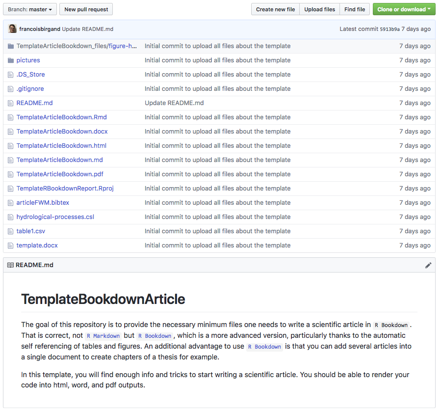

```{r setup, include=FALSE}
knitr::opts_chunk$set(echo = TRUE)
```
<br/>


## Reproducible research with `bookdown`

During a conversatin with [Dr. Rodrigo Vargas](http://udel.edu/~rvargas/Vargas/Home.html), the concept of 'reproducible research' appeared to truly be a pleonasm, as all published research, by nature, should be reproducible...! Well, in practice however, there are lots of good reasons to make sure that even within our own lab, we can reproduce other people's research, or at least the analysis of it. Anyway, in the [R markdown](tutorial-RMarkdown_instructions.html) tutorial, we go at length about the beauty of `R markdown`. This tutorial down not deny it, but it proposes to get to the next step: use the [`bookdown`](https://bookdown.org/yihui/bookdown/) package to write article, as the figure, table, and equation numbering is better integrated than the plain [`R markdown`](https://bookdown.org/yihui/rmarkdown/) package does. Additionally, the `bookdown` package has been thought to generate books. Well, for scientists and student scientists, this means that one could assemble articles together, to create books or theses...! 

## Downloadable tutorial

This tutorial is actually downloadable from my GitHub site. So for this, you go to this [https://github.com/francoisbirgand/TemplateBookdownArticle](https://github.com/francoisbirgand/TemplateBookdownArticle) website. You should have on your screen something like this:

</br>

{width=70%}

</br>

On the green 'Clone or Download' rectangle, download the package on your computer. Then open the project in `R Studio`, open the `TemplateArticleBookdown.Rmd` file, and `Knit` the file (actually use the downward triangle arrow) into html, pdf, or word. All other instructions are in the document. 

All you have to do after that is to write the article...!

